# DKM — uživatelská příručka krok za krokem

Tahle příručka vás provede nástrojem **DKM (Dynamický správce znalostí)** od úplně
prázdné stránky až po hotový projekt, který můžete sdílet s kolegy. Není to referenční
popis všech voleb — na to je [`docs-cs.md`](../docs-cs.md) vedle aplikace. Tady se
klika: *klikněte sem, napište tohle, pak tamto*.

Všechny obrázky vznikly proklikáním skutečné aplikace. Šedý kód v pravém dolním rohu
každé obrazovky (`#scrallview`, `#dlgaddrel`…) je **identifikátor obrazovky** — když si
nebudete jistí, jestli jste na správném místě, porovnejte ho s tím na obrázku. Seznam
všech identifikátorů je v [`screens.md`](../screens.md).

> **DKM nemá žádný předepsaný obsah.** Jaké typy záznamů budete vést, si určujete sami —
> může to být evidence smluv, přehled zařízení, znalostní báze, seznam rizik, cokoliv.
> Příručka proto používá nejobyčejnější možný příklad: **projekty, úkoly a lidi**.
> Kdekoliv v ní stojí *Projekt* nebo *Úkol*, dosaďte si svoje vlastní pojmy — postup
> je stejný.

---

## Obsah

1. [Než začnete](#1-než-začnete)
2. [Založení projektu](#2-založení-projektu)
3. [Datový model: seznam hodnot](#3-datový-model-seznam-hodnot)
4. [Datový model: typy entit](#4-datový-model-typy-entit)
5. [Datový model: aspekty](#5-datový-model-aspekty)
6. [Datový model: typy vazeb](#6-datový-model-typy-vazeb)
7. [První entita](#7-první-entita)
8. [Vazby mezi entitami](#8-vazby-mezi-entitami)
9. [Aspekt a komentář u entity](#9-aspekt-a-komentář-u-entity)
10. [Seznam entit a orientace v něm](#10-seznam-entit-a-orientace-v-něm)
11. [Hledání a pokročilé filtry](#11-hledání-a-pokročilé-filtry)
12. [Uložené pohledy](#12-uložené-pohledy)
13. [Zobrazení dat: tabulka, kanban, časová osa, kalendář](#13-zobrazení-dat-tabulka-kanban-časová-osa-kalendář)
14. [Náhled, panely a samostatná okna](#14-náhled-panely-a-samostatná-okna)
15. [Inbox](#15-inbox)
16. [Hromadné operace](#16-hromadné-operace)
17. [Rychlá paleta](#17-rychlá-paleta)
18. [Ukládání a načítání projektu](#18-ukládání-a-načítání-projektu)
19. [Co se změnilo od posledního uložení](#19-co-se-změnilo-od-posledního-uložení)
20. [Export dat](#20-export-dat)
21. [Export a tisk jedné entity](#21-export-a-tisk-jedné-entity)
22. [Diagram v PlantUML](#22-diagram-v-plantuml)
23. [Přenos části projektu jinam (balíček)](#23-přenos-části-projektu-jinam-balíček)
24. [Import z tabulky](#24-import-z-tabulky)
25. [Statický prohlížeč pro ty, kdo DKM nemají](#25-statický-prohlížeč-pro-ty-kdo-dkm-nemají)
26. [Nastavení, které se hodí znát](#26-nastavení-které-se-hodí-znát)
27. [Klávesové zkratky](#27-klávesové-zkratky)
28. [Když se něco nedaří](#28-když-se-něco-nedaří)

---

## 1. Než začnete

**Otevřete aplikaci** — buď online na <https://nastroje.egdilna.cz/dkm>, nebo si stáhněte
soubor `index.html` a otevřete ho poklepáním. Obojí funguje stejně, protože **celý DKM je
jeden HTML soubor**. Nic se neinstaluje, nic se nikam neposílá.

Po prvním otevření uvidíte tohle:

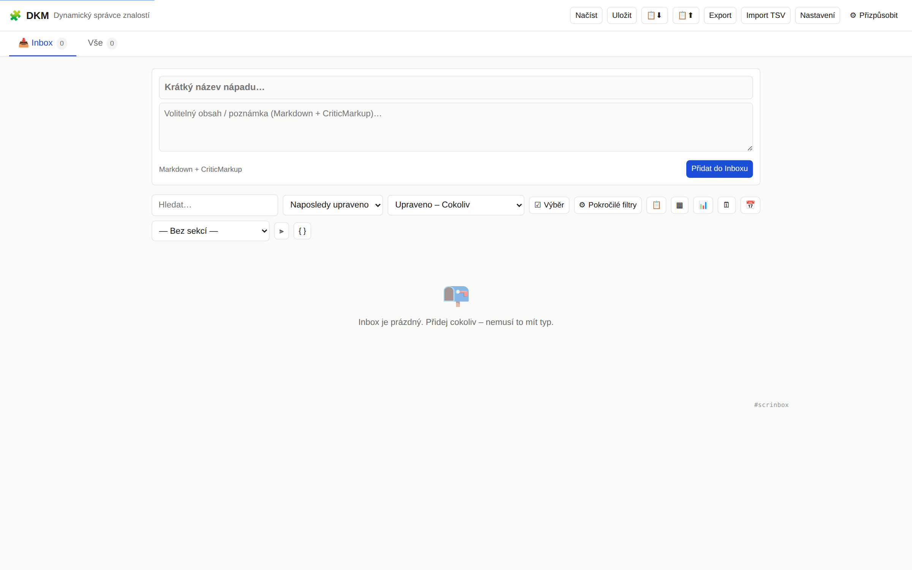

Aplikace je prázdná a stojíte na záložce **Inbox**. To je v pořádku — DKM totiž nemá
žádný předpřipravený datový model. Nejdřív si tedy popíšeme, **s čím budeme pracovat**,
a teprve pak začneme zapisovat data.

Pořadí, ve kterém se to dělá, je vždycky stejné:

```
seznam hodnot  →  typy entit  →  aspekty  →  typy vazeb  →  data
```

> **Kde data žijí.** Projekt existuje v této záložce prohlížeče. Obnovení stránky (F5)
> přežije, zavření záložky ne. Proto si projekt průběžně ukládejte do souboru
> (kapitola 18) — je to totéž jako Ctrl+S ve Wordu, jen si to musíte pamatovat sami.

---

## 2. Založení projektu

1. V hlavičce klikněte na **Nastavení**.
2. V levém sloupci je vybraná sekce **Projekt**.
3. Do pole **Název projektu** napište, jak se má projekt jmenovat — v příručce to bude
   `Projekty a úkoly`.
4. Do pole **Popis** napište, k čemu projekt je.

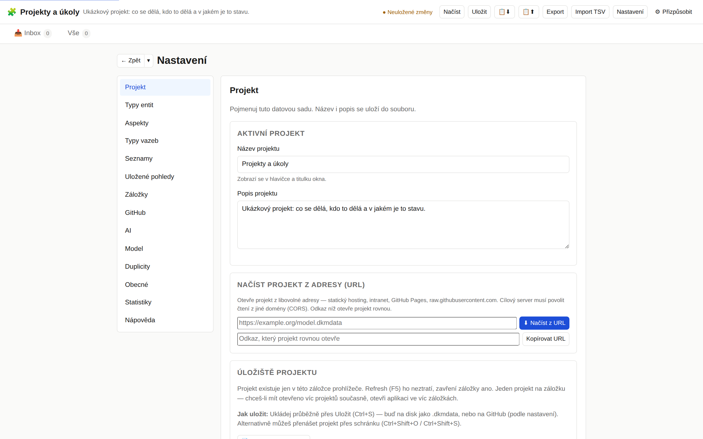

Název se hned objeví v hlavičce vlevo nahoře. Vedle něj se rozsvítí oranžové
**● Neuložené změny** — připomínka, že projekt zatím není nikde uložený.

---

## 3. Datový model: seznam hodnot

Než založíme typ entity, připravíme si **číselník** — pevnou nabídku hodnot, ze které se
bude vybírat. Vyhnete se tak překlepům typu „hotovo" / „Hotovo" / „HOTOVO" a získáte
něco, podle čeho se dá filtrovat a stavět kanban.

1. V Nastavení klikněte v levém sloupci na **Seznamy**.
2. Klikněte na **＋ Přidat seznam**.
3. Do pole **Název** napište `Stav`.
4. Do velkého pole **Hodnoty** napište každou hodnotu na vlastní řádek:

   ```
   Nový
   Probíhá
   Ke kontrole
   Hotovo
   ```

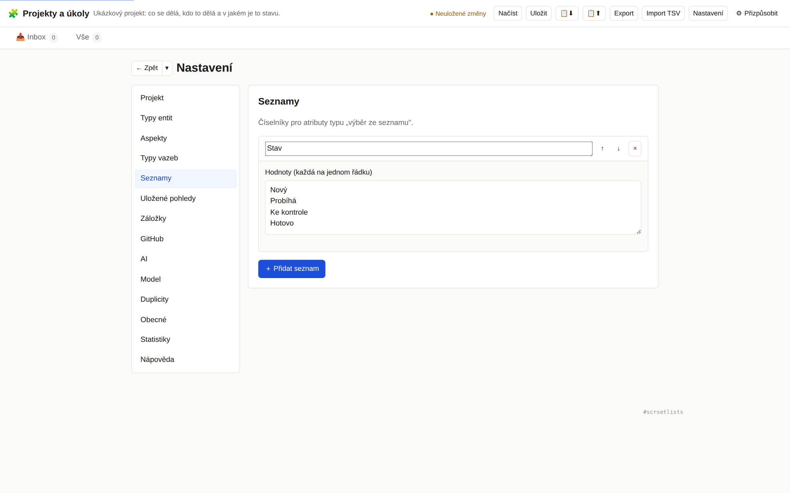

Nikde není tlačítko „Uložit" — **změny v nastavení platí okamžitě**. Stačí odklepnout
mimo pole.

---

## 4. Datový model: typy entit

**Typ entity** je šablona záznamu: říká, jaká pole entita má. V příkladu budeme
potřebovat tři — projekt, úkol a osobu.

### 4.1 Založení typu

1. V Nastavení klikněte na **Typy entit**. Seznam je zatím prázdný.

   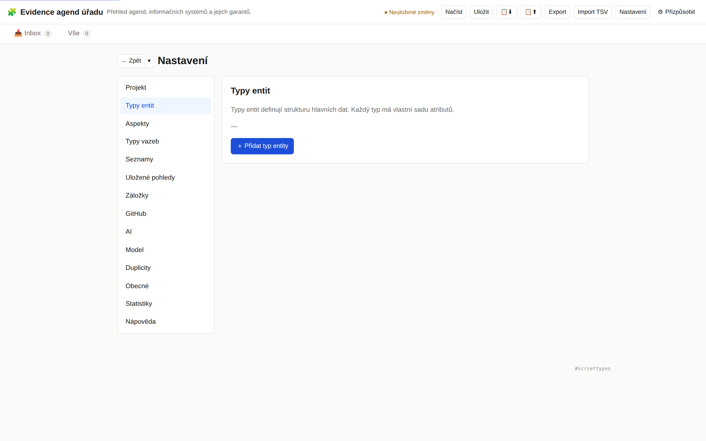

2. Klikněte na **＋ Přidat typ entity**.
3. Do pole **Ikona** napište emotikonu `📁` — bude entitu odlišovat v každém seznamu.
4. Do pole **Název** napište `Projekt`.
5. Pole **Klíč v JSON** nechte prázdné. Vyplňte ho jen tehdy, když víte, že budete data
   exportovat do jiného systému a potřebujete mít název pole neměnný.

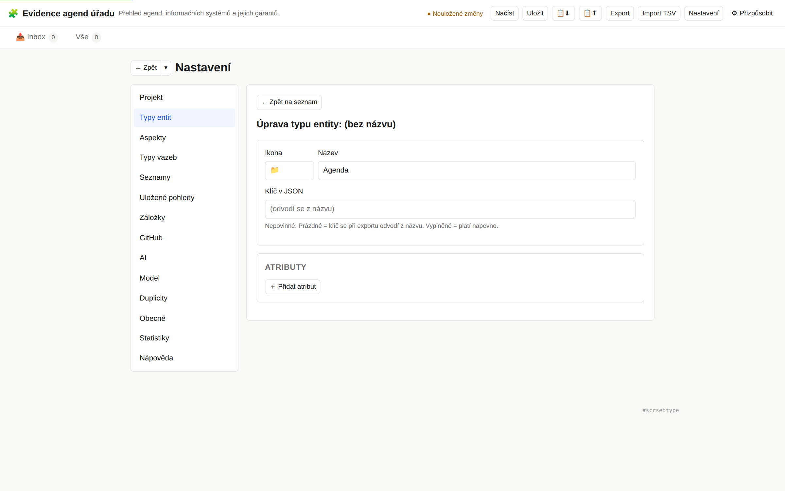

### 4.2 Atributy typu

Teď typu přidáme pole. Pro každý atribut klikněte na **＋ Přidat atribut** a vyplňte
řádek, který přibude:

| Název atributu | Typ | Zaškrtněte |
|---|---|---|
| `Kód` | Text (jeden řádek) | Zobrazit v seznamu |
| `Popis` | Text (víceřádkový, Markdown + CriticMarkup) | — |
| `Stav` | Výběr ze seznamu | Zobrazit v seznamu |
| `Termín` | Datum | — |

U atributu **Stav** se po zvolení typu *Výběr ze seznamu* objeví vpravo rozbalovátko
**Seznam** — vyberte v něm `Stav`, tedy číselník z kapitoly 3.

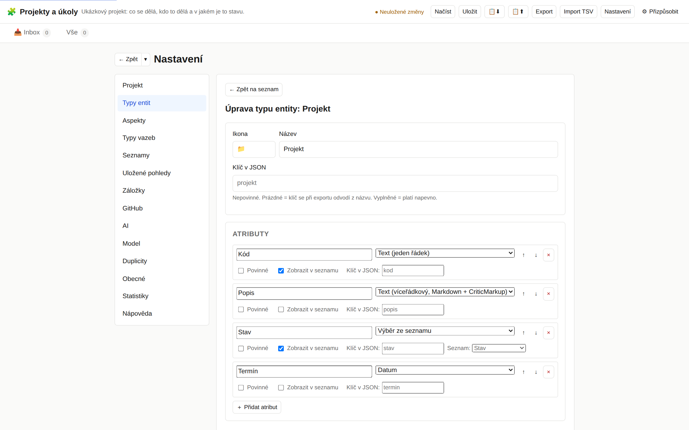

Zaškrtávátko **Zobrazit v seznamu** znamená, že se hodnota vypíše rovnou na kartě entity,
aniž byste ji museli otevírat. Šetřete s ním — dva tři atributy stačí, jinak se karty
rozbují.

**Typy atributů, ze kterých se vybírá:**

| Typ | K čemu |
|---|---|
| Text (jeden řádek) | krátké údaje — kód, jméno, číslo jednací |
| Text (víceřádkový) | popisy a poznámky; umí Markdown a značky revizí |
| Datum | termíny, data platnosti |
| URL | odkazy — v detailu se z nich stane proklik |
| Výběr ze seznamu | hodnota z číselníku |
| Ano/Ne | přepínač |
| Relace na entitu | odkaz na jiný záznam přímo v atributu |
| Číslo | částky, počty, odhady |

### 4.3 Zbylé dva typy

Klikněte na **← Zpět na seznam** a stejným postupem založte:

- **✅ Úkol** — atributy `Popis` (víceřádkový text), `Stav` (výběr ze seznamu *Stav*,
  zobrazit v seznamu), `Termín` (datum), `Odhad (hodin)` (číslo)
- **👤 Osoba** — atributy `E-mail` (text, zobrazit v seznamu), `Role` (text)

Výsledek:

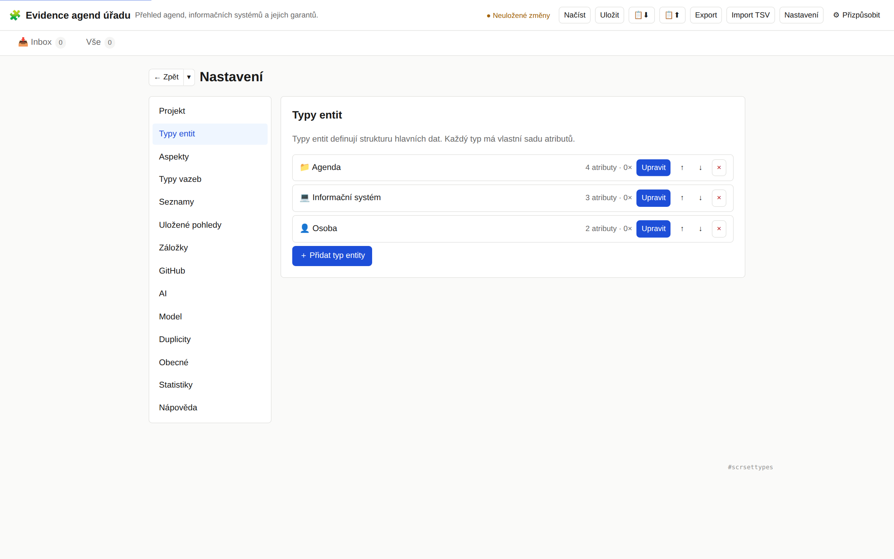

Pořadí typů (a stejně tak aspektů, vazeb i atributů uvnitř typu) se dá měnit —
buď **přetažením myší**, nebo tlačítky **↑ ↓** u položky. Pořadí atributů určuje, jak
za sebou jdou pole v editoru entity, takže se vyplatí ho srovnat podle toho, jak
záznamy skutečně vyplňujete.

---

## 5. Datový model: aspekty

**Aspekt** je průřezová sada atributů, kterou přilepíte na entitu **jakéhokoli typu**.
Hodí se přesně tam, kde by vám typ nestačil: informace o penězích se může týkat projektu
i jednotlivého úkolu, a zakládat kvůli tomu nové typy by bylo špatně.

1. V Nastavení klikněte na **Aspekty**.
2. Klikněte na **＋ Přidat aspekt**.
3. **Název**: `Rozpočet`.
4. Přidejte dva atributy:
   - `Náklady` — typ **Číslo**
   - `Schváleno` — typ **Ano/Ne**

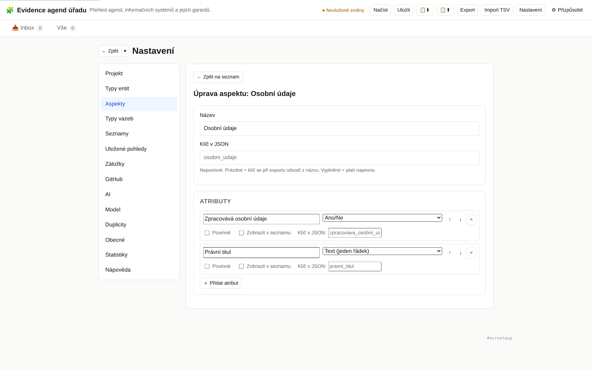

**Kdy typ a kdy aspekt?** Typ odpovídá na otázku „co to je" (projekt, úkol, osoba).
Aspekt odpovídá na „co se toho navíc týká" (rozpočet, osobní údaje, utajení).
Entita má **právě jeden typ** a **libovolný počet aspektů**.

Poznat to jde jednoduchou zkouškou: kdyby vám z toho vznikly typy *Projekt* a *Projekt
s rozpočtem*, patří ta věc do aspektu.

---

## 6. Datový model: typy vazeb

**Vazba** propojuje dvě entity a má vlastní název, takže z ní jde přečíst věta.

1. V Nastavení klikněte na **Typy vazeb**.
2. Klikněte na **＋ Přidat typ vazby**.
3. **Název vazby**: `Obsahuje`.
4. **Opačný název**: `Je součástí` — tenhle text uvidí protistrana v sekci
   „Odkazuje sem".
5. **Rozsah** nechte na *univerzální*. Znamená to „smí spojit cokoliv s čímkoliv".
   Kdybyste chtěli hlídat, že *Obsahuje* vede jen z projektu na úkol, přepněte rozsah
   a vyberte povolené typy.

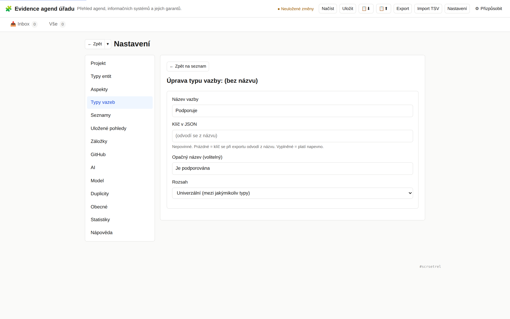

Stejným způsobem založte ještě druhý typ vazby: **Odpovídá** s opačným názvem
`Odpovídá za`.

Datový model je hotový. Teď do něj nasypeme data.

---

## 7. První entita

1. Vraťte se do hlavního pohledu — klikněte v horní liště na záložku **Vše**.
2. Klikněte na **＋ Nová entita** (nebo stiskněte klávesu **N**).
3. Vyskočí nabídka typů. Klikněte na **📁 Projekt**.

   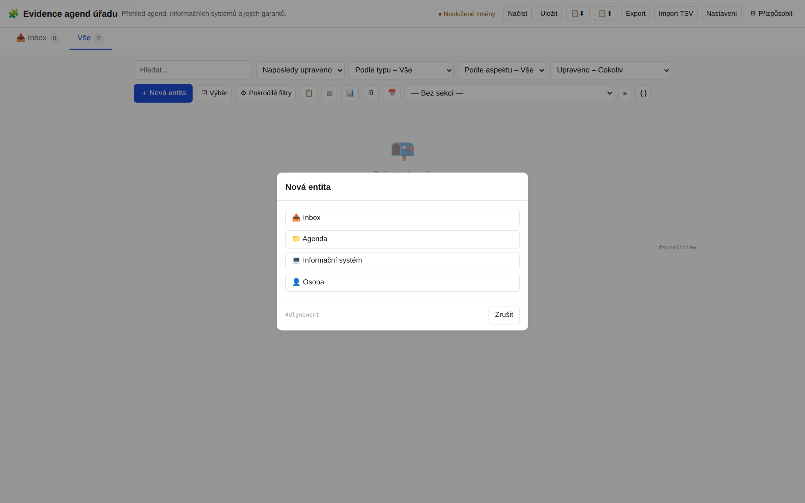

4. Otevře se prázdný editor. Všimněte si, že pole odpovídají přesně tomu, co jste
   nadefinovali v kapitole 4.

   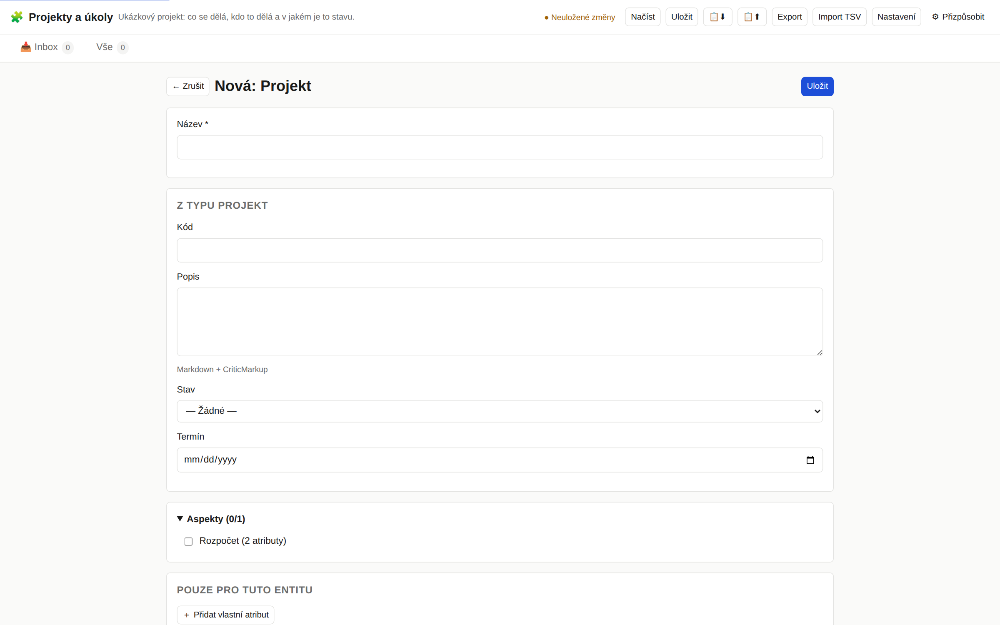

5. Vyplňte:
   - **Název**: `Nové webové stránky`
   - **Kód**: `P-01`
   - **Popis**: libovolný text; můžete použít Markdown, takže `**tučně**` opravdu
     ztuční
   - **Stav**: `Probíhá`
   - **Termín**: `31. 12. 2026`

   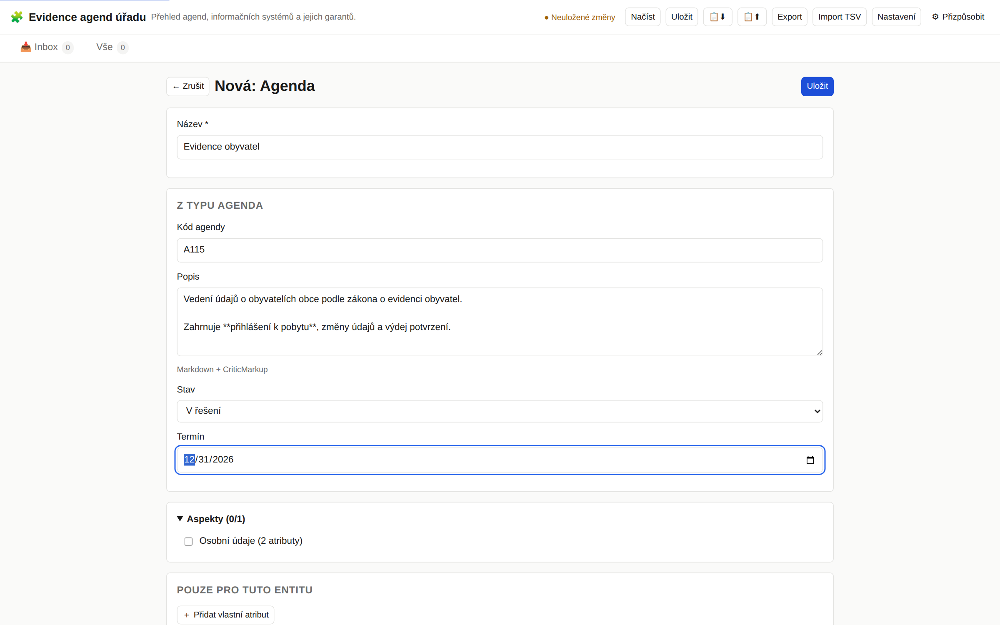

6. Klikněte na **Uložit** (nebo stiskněte **U**).

Otevře se detail entity — takhle bude záznam vypadat pokaždé, když ho otevřete:

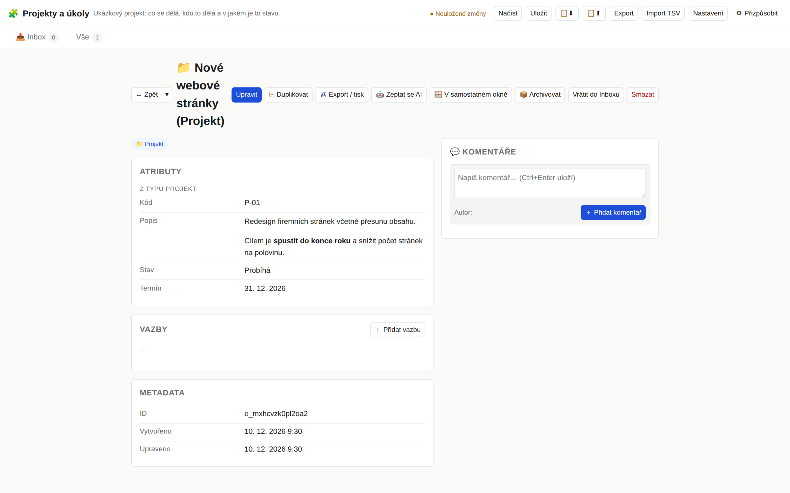

Nahoře jsou akce, které s entitou můžete udělat: **Upravit**, **Duplikovat**,
**🖨 Export / tisk**, **🪟 V samostatném okně**, **📦 Archivovat**, **Smazat**.

---

## 8. Vazby mezi entitami

Než půjdeme dál, založte stejným postupem ještě pár entit, ať je co propojovat: druhý
projekt (`Stěhování kanceláře`), čtyři úkoly (`Návrh grafiky`, `Migrace obsahu`,
`Výběr dodavatele`, `Revize smluv`) a dvě osoby (`Jana Dvořáková`, `Petr Málek`).

Seznam pak vypadá takhle:

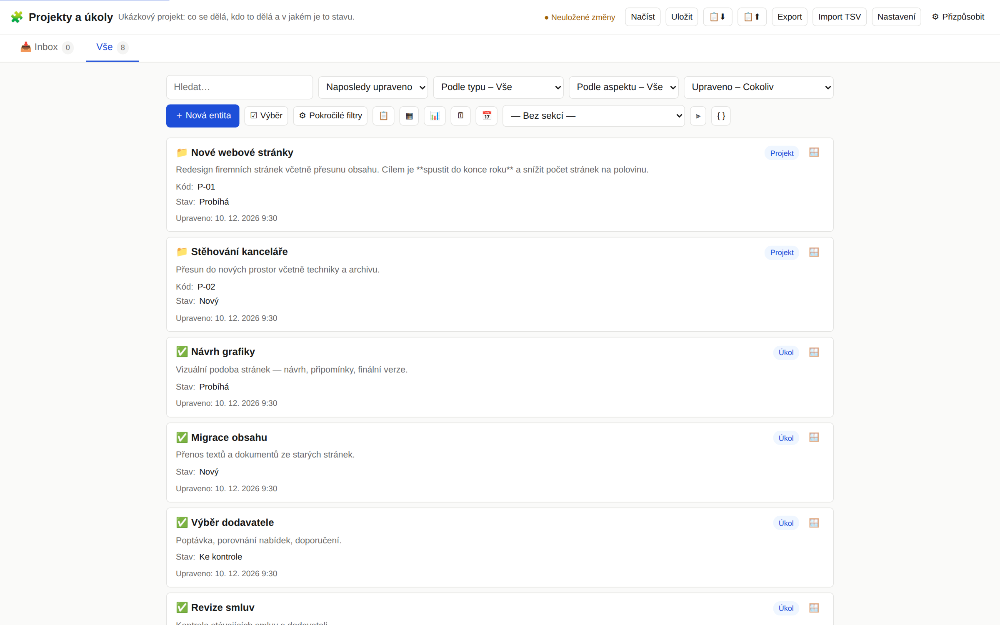

Teď propojíme projekt s úkoly, které do něj patří:

1. Klikněte na kartu **Nové webové stránky** — otevře se její detail.
2. V sekci **Vazby** klikněte na **＋ Přidat vazbu** (nebo stiskněte **Alt+R**).
3. V horním rozbalovátku vyberte typ vazby **Obsahuje**.
4. Pod ním je filtr a vlastní výběr. Ve **Výběru** označte `✅ Návrh grafiky [Úkol]`.

   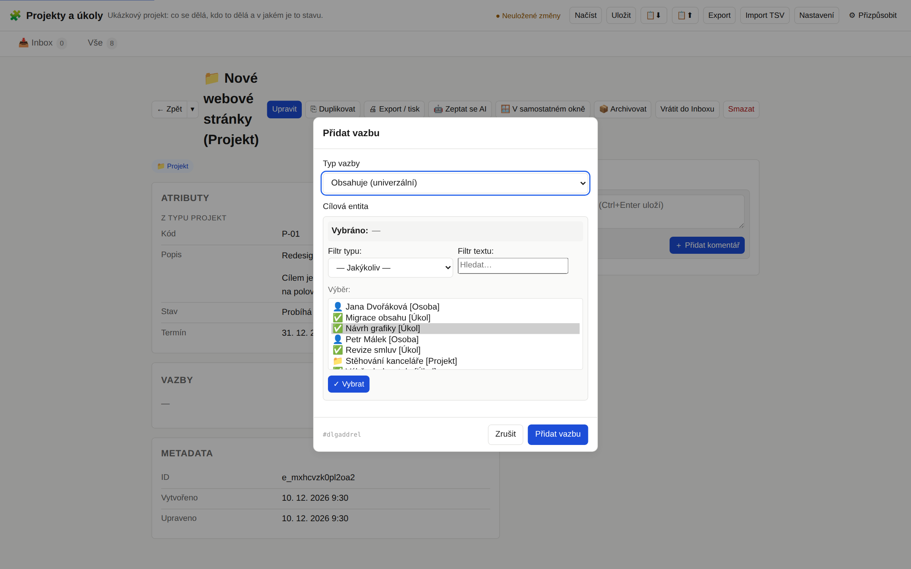

5. Klikněte na **Přidat vazbu**.

Zopakujte to pro `Migrace obsahu` a nakonec přidejte vazbu typu **Odpovídá** na
`👤 Jana Dvořáková`. Detail teď ukazuje všechny tři vazby a pod nimi **Strukturální
pohled** — rozklikávací strom, kterým se dá po vazbách procházet:

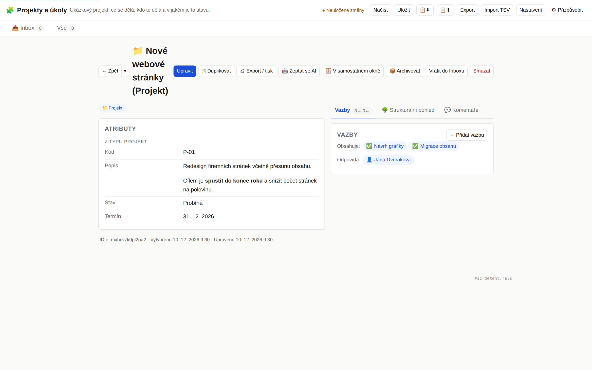

> **Zpětné odkazy.** Když teď otevřete `Návrh grafiky`, uvidíte v sekci **Odkazuje sem**
> položku `Je součástí ←` s projektem. Nemusíte tedy zakládat vazbu z obou stran — DKM
> ji vidí oběma směry.

---

## 9. Aspekt a komentář u entity

### 9.1 Přidání aspektu

1. V detailu entity `Nové webové stránky` klikněte na **Upravit**.
2. Sjeďte do sekce **Aspekty** a zaškrtněte **Rozpočet**. Okamžitě se objeví jeho
   atributy.

   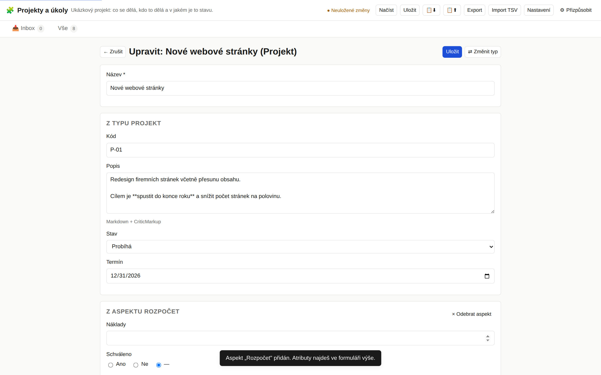

3. Vyplňte **Náklady** a zaškrtněte **Schváleno**.
4. Klikněte na **Uložit**.

Kdykoliv později můžete tentýž aspekt přidat i úkolu — na typu nezáleží.

### 9.2 Komentář

Komentáře jsou pro poznámky, které nepatří do atributů — proč se něco rozhodlo, co je
ještě potřeba doladit.

1. V detailu entity je vpravo sekce **Komentáře**.
2. Do pole napište text.
3. Klikněte na **＋ Přidat komentář** (nebo stiskněte **Ctrl+Enter**).

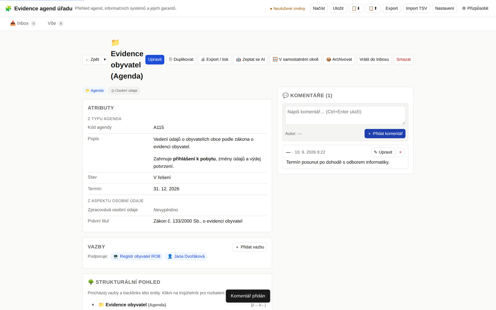

Jméno autora si nastavíte v **Nastavení → Obecné**; ukládá se do prohlížeče, ne do dat
projektu, takže každý kolega bude podepsaný svým jménem.

---

## 10. Seznam entit a orientace v něm

Klikněte na záložku **Vše**. Nad seznamem je lišta, ve které se dá:

- **Hledat…** — fulltext přes názvy i textové atributy
- **Řadit** — podle úpravy, názvu nebo vytvoření
- **Filtrovat** podle typu, aspektu a data úpravy
- **＋ Nová entita**, **☑ Výběr** (hromadné akce), **⚙ Pokročilé filtry**
- **📋 ▦ 📊 🗓 📅** — přepínač zobrazení (kapitola 13)
- **⫸** — náhled vedle seznamu (kapitola 14)
- **— Bez sekcí —** — rozdělení seznamu do mezinadpisů podle zvoleného atributu

Karta entity nese ikonu typu, název, štítky typu a aspektů, výtah z popisu, hodnoty
atributů se zapnutým *Zobrazit v seznamu*, datum úpravy a počet vazeb. **Klik kamkoliv
na kartu** otevře detail; ikona 🪟 vpravo nahoře otevře entitu rovnou v samostatném okně.

---

## 11. Hledání a pokročilé filtry

### 11.1 Fulltext

Do pole **Hledat…** napište část slova, třeba `migr`. Seznam se filtruje průběžně:

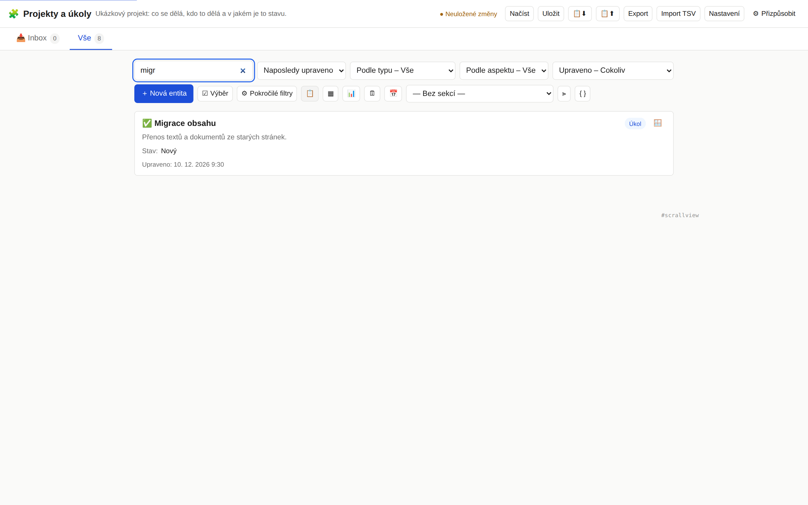

Než půjdete dál, pole zase vyprázdněte.

### 11.2 Pravidlový filtr

Fulltext hledá v textu. Když potřebujete „všechny úkoly, na kterých se zrovna dělá",
je na to pravidlový filtr:

1. Klikněte na **⚙ Pokročilé filtry**.
2. Klikněte na **＋ Přidat pravidlo**.
3. V prvním rozbalovátku (**Atribut**) vyberte `Úkol / Stav`. Kromě atributů tu
   najdete i systémové vlastnosti — název, typ, aspekty, počet vazeb, datum vytvoření.
4. **Operátor** nechte na *rovná se*.
5. Ve třetím poli vyberte hodnotu `Probíhá`.

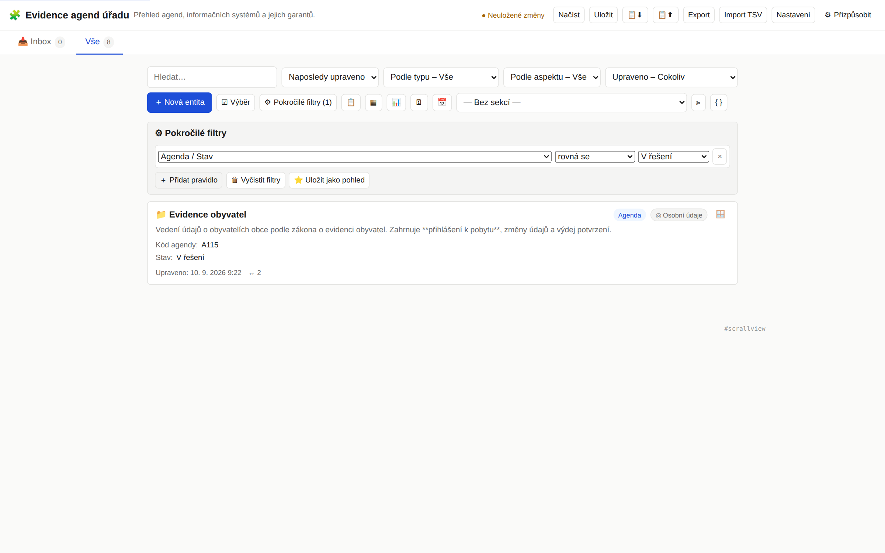

Počet aktivních pravidel se ukáže přímo na tlačítku: **⚙ Pokročilé filtry (1)**.
Tlačítko **🗑 Vyčistit filtry** je všechna zruší.

---

## 12. Uložené pohledy

Filtr, který budete používat opakovaně, si uložte.

1. Nechte filtr z předchozí kapitoly zapnutý.
2. Klikněte na **⭐ Uložit jako pohled**.
3. Do pole **Název pohledu** napište `Rozpracované úkoly`.
4. Chcete-li mít pohled po ruce jako záložku vedle *Inboxu* a *Vše*, zaškrtněte
   **Připnout jako záložku**.
5. Klikněte na **Uložit**.

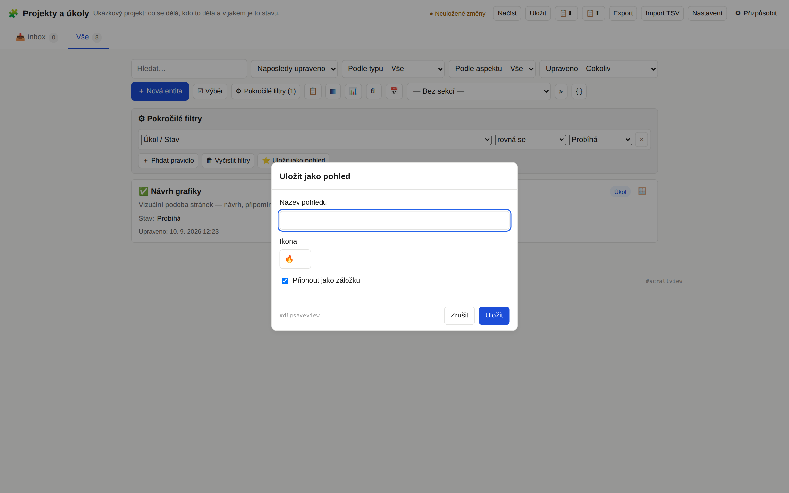

Pohled si pamatuje i způsob zobrazení a řazení — když ho uložíte v kanbanu, otevře se
v kanbanu. Spravovat je můžete v **Nastavení → Uložené pohledy**.

---

## 13. Zobrazení dat: tabulka, kanban, časová osa, kalendář

Stejná data, čtyři různé pohledy. Přepínají se ikonami v liště nad seznamem.

### ▦ Tabulka

Klikněte na **▦**. Řádek = entita, sloupce = atributy. Klikem na hlavičku sloupce se
řadí (vzestupně → sestupně → zpět). Tabulka se needituje — je to pohled, ne formulář.

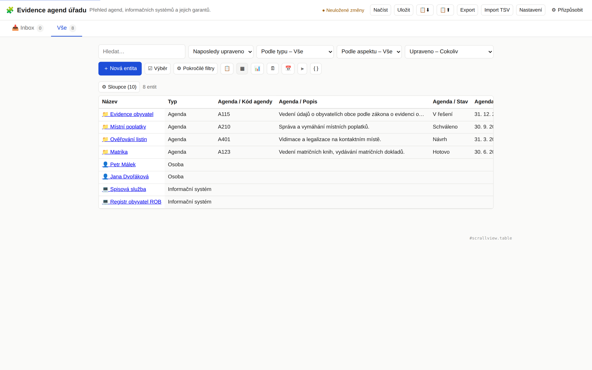

### 📊 Kanban

Klikněte na **📊**. Nad sloupci je rozbalovátko **Sloupce podle** — vyberte atribut typu
*Výběr ze seznamu*, tedy `Úkol / Stav`. Každá hodnota číselníku dostane vlastní sloupec
a entity bez té hodnoty (v našem případě projekty a osoby) spadnou do sloupce
*(bez hodnoty)*.

Kartu přesunete přetažením, nebo — což je spolehlivější — rozbalovátkem **Přesunout do**
přímo na kartě.

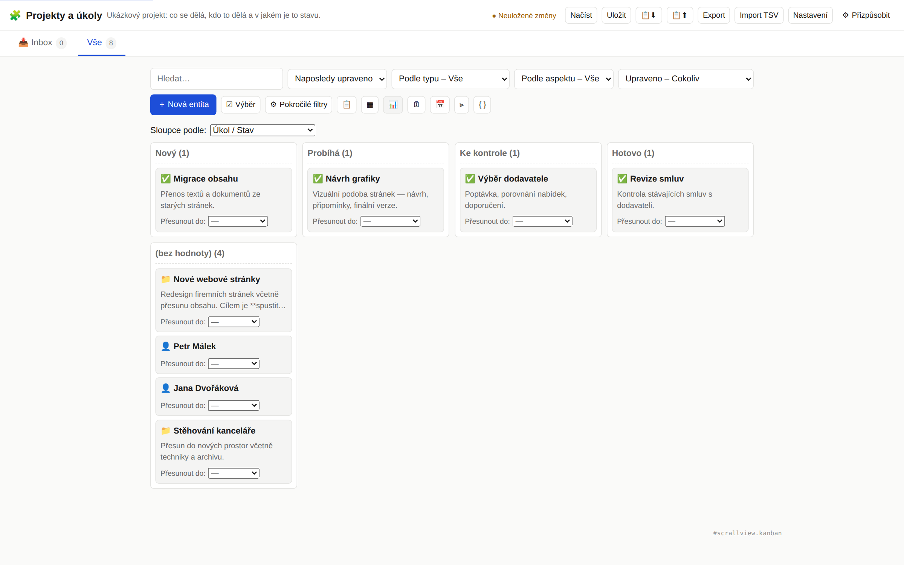

### 📅 Časová osa

Klikněte na **📅**. Entity se seřadí podle data — hodí se, když sledujete termíny.

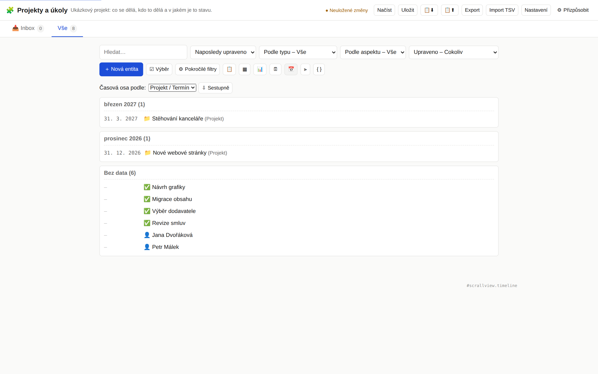

### 🗓 Kalendář

Klikněte na **🗓**. Měsíční mřížka s entitami v dnech podle jejich datového atributu.

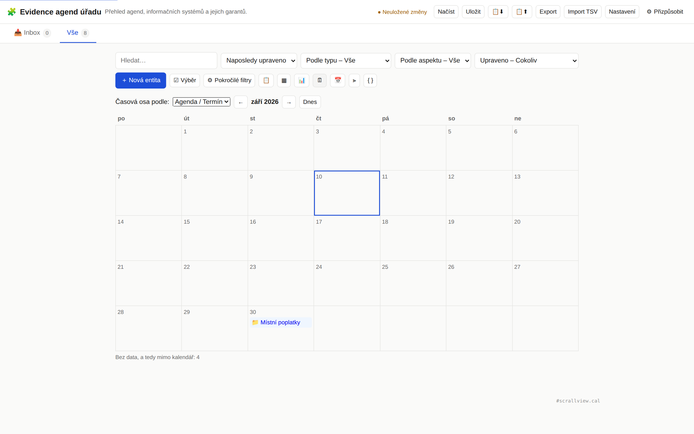

Zpátky na obyčejný seznam se vrátíte ikonou **📋**.

---

## 14. Náhled, panely a samostatná okna

### 14.1 Náhled vedle seznamu

Když procházíte hodně záznamů, je otravné pořád klikat tam a zpátky.

1. Klikněte na ikonu **⫸** v liště.
2. Klikněte na libovolnou kartu — detail se otevře **vpravo vedle seznamu**, seznam
   zůstane na místě.

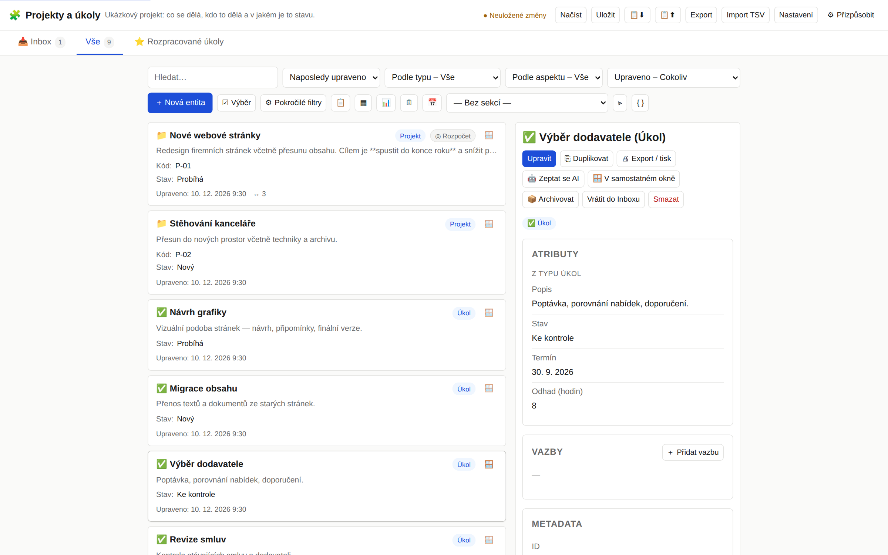

Dalším klikem na **⫸** se náhled vypne.

### 14.2 Panely

**Ctrl+T** otevře nový panel. Panel je nezávislý pracovní kontext — vlastní pohled,
vlastní filtry, vlastní otevřená entita. Nad obsahem se objeví lišta panelů a přepínáte
se mezi nimi klikem. **Ctrl+W** aktivní panel zavře.

Hodí se, když porovnáváte dva záznamy nebo si v jednom panelu držíte filtrovaný seznam
a ve druhém pracujete.

### 14.3 Samostatné okno entity

Ikona **🪟** — na kartě v seznamu i v detailu entity — otevře entitu v novém okně
prohlížeče. Okno je odlehčené: bez záložek a navigace, jen ta jedna entita. Změny se
mezi okny **synchronizují živě**, takže si můžete jednu entitu vytáhnout na druhý
monitor a pracovat s ní vedle hlavního okna.

---

## 15. Inbox

**Inbox** je místo pro nápady, které ještě nemají typ. Padne něco na poradě, hodíte to
sem a zatřídíte později.

1. Klikněte na záložku **📥 Inbox**.
2. Do horního pole napište krátký název.
3. Do pole pod ním můžete připsat poznámku.

   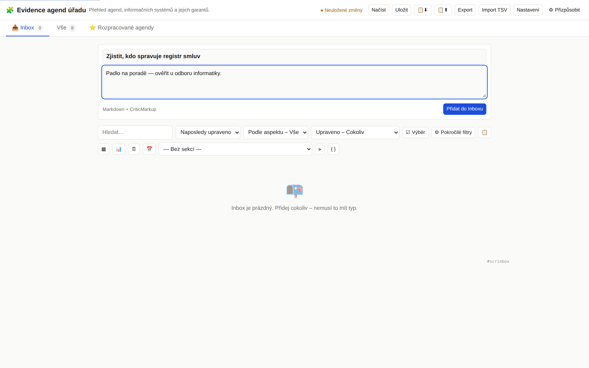

4. Klikněte na **Přidat do Inboxu**.

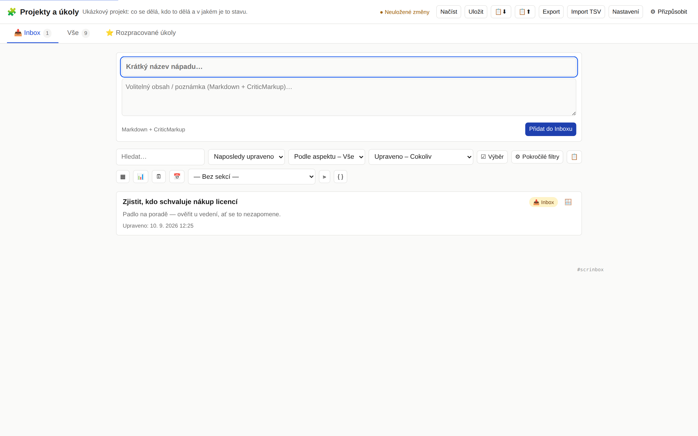

Až budete vědět, co s tím, otevřete položku a klikněte na **Změnit typ** — z nápadu se
stane plnohodnotná entita se všemi atributy svého typu.

---

## 16. Hromadné operace

Když potřebujete změnit deset záznamů najednou, nedělejte to po jednom.

1. V seznamu klikněte na **☑ Výběr** (nebo stiskněte **V**). U každé karty se objeví
   zaškrtávátko.
2. Naklikejte entity, kterých se změna týká. Nahoře se objeví lišta **Vybráno: 2**.

   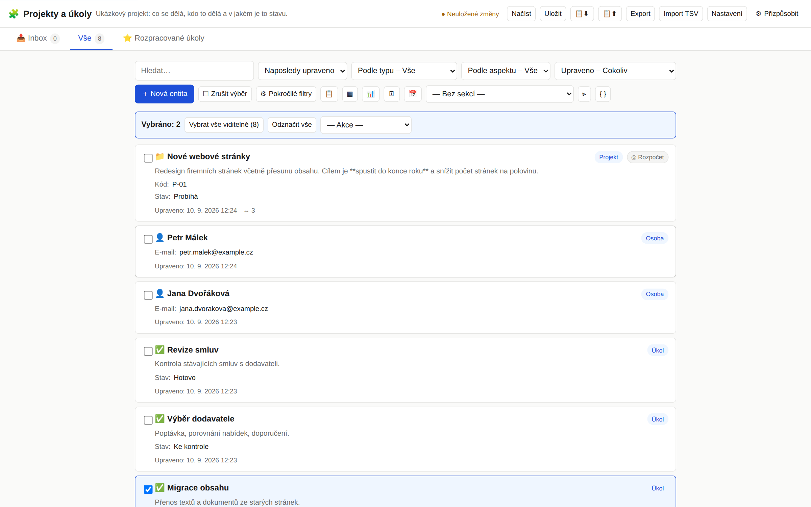

3. V rozbalovátku **— Akce —** vyberte, co se má stát. Na výběr je změna typu, přidání
   či odebrání aspektu, nastavení nebo vyprázdnění atributu, přidání vazby, sloučení
   entit, export, archivace i smazání.
4. Vedle rozbalovátka se objeví tlačítko, které akci **spustí**. Teprve po jeho stisku
   se něco stane — samotný výběr akce nic neprovede.

Příklad — hromadné přidání aspektu:

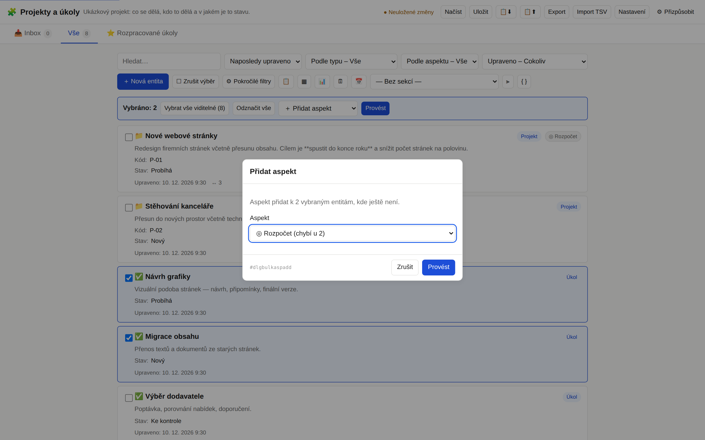

> **Sloučení entit** je jediná operace, kterou nejde vzít zpět jinak než načtením
> zálohy. Před ním si projekt uložte.

---

## 17. Rychlá paleta

Nejrychlejší způsob, jak se v projektu pohybovat.

1. Stiskněte **Ctrl+P**.
2. Začněte psát — třeba `graf`.
3. Šipkami vyberte položku a stiskněte **Enter**.

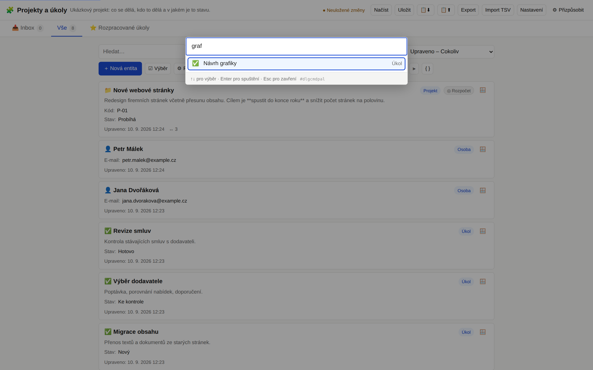

Paleta hledá entity, obrazovky nastavení, uložené pohledy i akce (přepnutí motivu,
export, uložení). Nemusíte psát celé slovo — hledá se „fuzzy", takže `rzp` najde
*Rozpracované úkoly*.

---

## 18. Ukládání a načítání projektu

DKM nemá server, takže **uložení znamená stažení souboru**.

### Uložení

Klikněte v hlavičce na **Uložit** (nebo **Ctrl+S**). Stáhne se soubor s příponou
`.dkmdata` — je to obyčejný JSON, takže se dá verzovat, posílat mailem i prohlížet.

Uložte ho někam, kde ho najdete. Oranžová značka **● Neuložené změny** v hlavičce
zhasne.

### Načtení

Klikněte na **Načíst** (nebo **Alt+L**) a vyberte svůj `.dkmdata` soubor. Projekt bude
přesně tam, kde jste ho nechali.

### Přes schránku

Ikony **📋⬇** a **📋⬆** v hlavičce projekt vloží do schránky nebo z ní načtou. Hodí se,
když si projekt posíláte chatem a nechcete zakládat soubor.

---

## 19. Co se změnilo od posledního uložení

Než projekt uložíte nebo pošlete dál, můžete si nechat vypsat, co jste vlastně změnili.

Klikněte na oranžové **● Neuložené změny** v hlavičce.

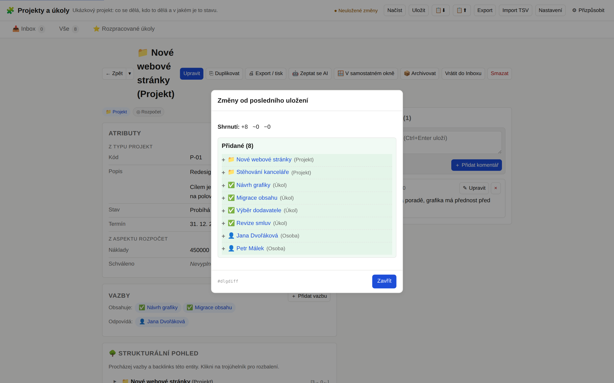

Dialog rozdělí změny na **přidané**, **odstraněné** a **upravené** a u upravených ukáže
změnu pole po poli. Časové razítko úpravy se za změnu nepovažuje.

---

## 20. Export dat

**Všechno, co jde z DKM ven, vede jedním dialogem.** Klikněte v hlavičce na **Export**.

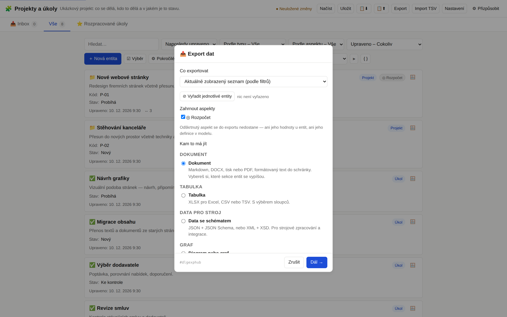

Nahoře zvolíte **co exportovat** (celý projekt, aktuálně zobrazený seznam podle filtrů,
nebo vybrané entity) a pod tím **kam to má jít**:

| Cíl | K čemu je |
|---|---|
| **Dokument** | Markdown, DOCX, tisk nebo PDF — pro lidi ke čtení |
| **Tabulka** | XLSX, CSV, TSV — pro Excel a další zpracování |
| **Data se schématem** | JSON + JSON Schema, nebo XML + XSD — pro navazující systém |
| **Diagram nebo graf** | PlantUML jako zdroj obrázku, GraphML pro Gephi či yEd |
| **Balíček pro jiný projekt** | soubor `.dkmpkg` — kus projektu i s modelem |
| **Statický prohlížeč** | jeden HTML soubor s daty k prohlížení |

Po volbě cíle klikněte na **Dál →**.

---

## 21. Export a tisk jedné entity

Někdy potřebujete jen jeden záznam — třeba kartu projektu do zápisu z porady.

1. Otevřete detail entity.
2. Klikněte na **🖨 Export / tisk**.
3. Zaškrtněte, které sekce se mají vypsat (atributy, vazby, zpětné odkazy, komentáře,
   objekty, metadata).
4. Zvolte formát a potvrďte.

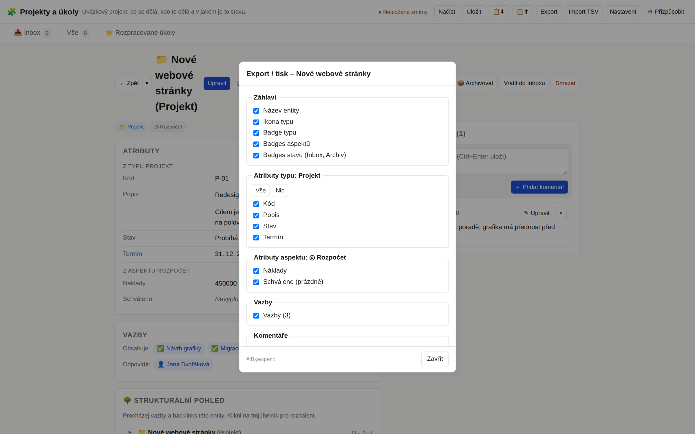

Tisk, DOCX i PDF jsou **vždy světlé**, i když v aplikaci máte tmavý motiv — jsou to
výstupy pro někoho jiného.

---

## 22. Diagram v PlantUML

DKM umí z dat vygenerovat zdrojový kód diagramu.

1. Klikněte na **Export** v hlavičce.
2. Vyberte **Diagram nebo graf** a klikněte na **Dál →**.

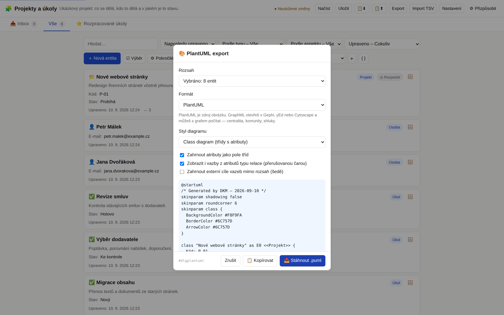

Vygenerovaný text zkopírujte do <https://www.plantuml.com/plantuml> nebo do libovolného
nástroje, který PlantUML umí, a máte obrázek modelu.

---

## 23. Přenos části projektu jinam (balíček)

Balíček `.dkmpkg` je vybraná část projektu **i s kouskem datového modelu**, který
k ní patří. Slouží k přenosu mezi projekty — jinak by v cílovém projektu chyběly typy
a atributy a data by se neměla kam uložit.

### Vytvoření balíčku

1. Klikněte na **Export**, vyberte rozsah a cíl **Balíček pro jiný projekt**.
2. Klikněte na **Dál →** a stáhněte soubor.

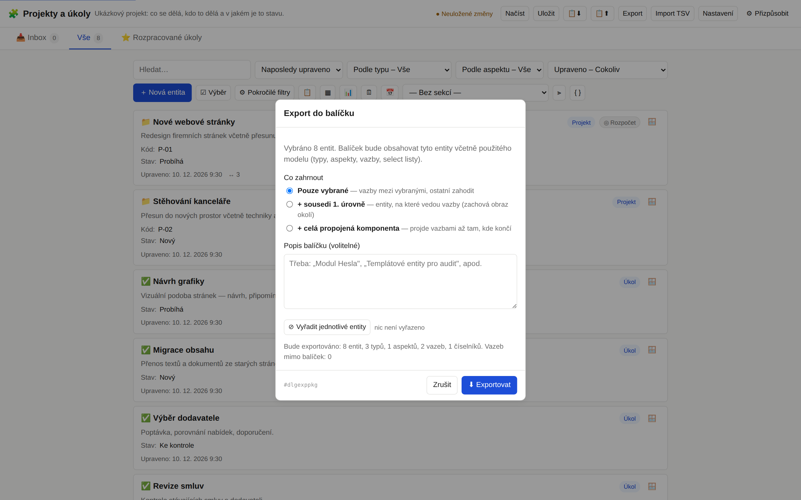

### Načtení balíčku

V cílovém projektu jděte do **Nastavení → Projekt** a klikněte na
**📥 Importovat balíček (.dkmpkg)**. Spustí se osmikrokový průvodce, který:

- napáruje typy a atributy balíčku na typy a atributy cílového projektu,
- najde entity, které už v projektu jsou, a nechá vás rozhodnout, co s nimi
  (doplnit, přepsat, přeskočit, založit kopii),
- ukáže **simulaci** — co přesně se stane, ještě než se to stane,
- **stáhne zálohu** projektu před samotným importem.

> Import je jediná operace, která umí přepsat existující data. Simulaci ani zálohu
> nepřeskakujte.

---

## 24. Import z tabulky

Máte-li data v Excelu, nemusíte je přepisovat.

1. Klikněte v hlavičce na **Import TSV**.
2. Vložte data ze schránky nebo vyberte soubor CSV / TSV.

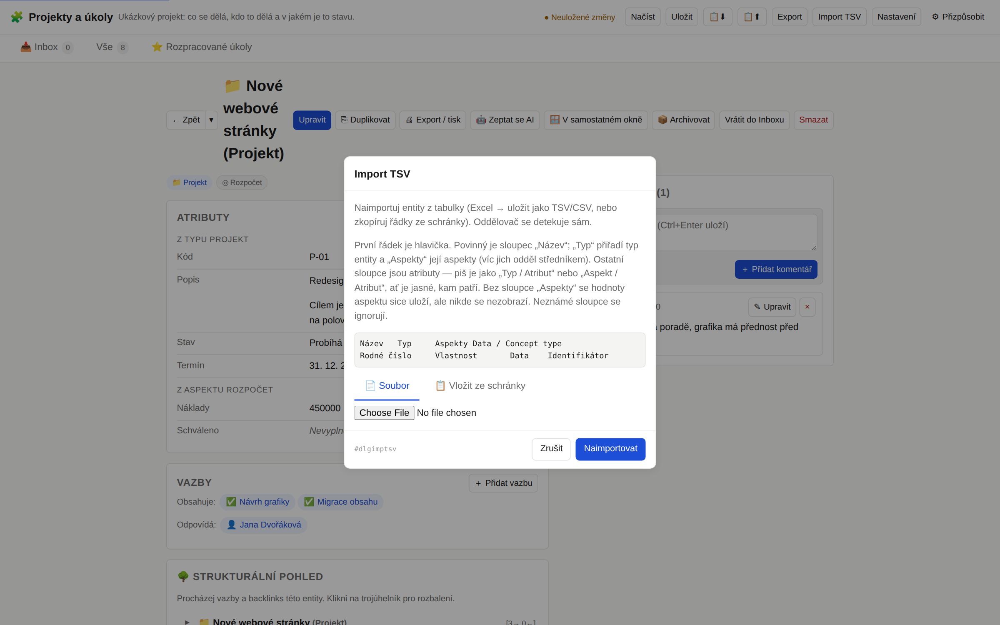

První řádek musí být hlavička s názvy sloupců:

- **`Název`** je povinný. Bez něj řádek neprojde.
- **`Typ`** určí typ entity. Když sloupec chybí, entita skončí bez typu v Inboxu.
- **`Aspekty`** — názvy aspektů oddělené středníkem nebo čárkou.
- **`ID`** — když ho vyplníte existujícím identifikátorem, entita se **aktualizuje**;
  jinak se založí nová.
- Ostatní sloupce se párují na atributy podle názvu. Vyplatí se psát je ve tvaru
  **`Název typu / Název atributu`** (třeba `Úkol / Termín`) — bez prefixu hledá import
  atribut nejdřív u typu a teprve pak u aspektů, což u shodných názvů uloží hodnotu
  jinam, než jste čekali.

**Nejjistější postup:** vyexportujte si nejdřív data do XLSX (kapitola 20), upravte je
a naimportujte zpět. Sloupce pak sedí na první pokus.

---

## 25. Statický prohlížeč pro ty, kdo DKM nemají

Potřebujete data ukázat někomu, kdo s nástrojem nikdy nepracoval?

1. Jděte do **Nastavení → Projekt**.
2. Klikněte na **⬇ Stáhnout HTML prohlížeč** (totéž najdete i v dialogu Export jako cíl
   *Statický prohlížeč*).

Stáhne se jeden HTML soubor, který obsahuje data i vlastní prohlížeč. Příjemce ho jen
otevře v prohlížeči — uvidí záložky, seznamy, detaily entit i vazby, ale nic nemůže
změnit. Funguje offline a dá se poslat mailem.

---

## 26. Nastavení, které se hodí znát

### Záložky

**Nastavení → Záložky.** Určuje, které typy, aspekty a uložené pohledy se ukazují
v horní liště. Když máte typů deset, nechte v liště jen ty, se kterými opravdu pracujete.

Pořadí záložek změníte **přetažením myší** přímo v liště; typy se přerovnávají mezi typy
a aspekty mezi aspekty, přes hranici skupiny to nejde. Kdo myš nechce nebo nemůže
použít, má u každé položky tlačítka **↑ ↓** — dělají totéž.

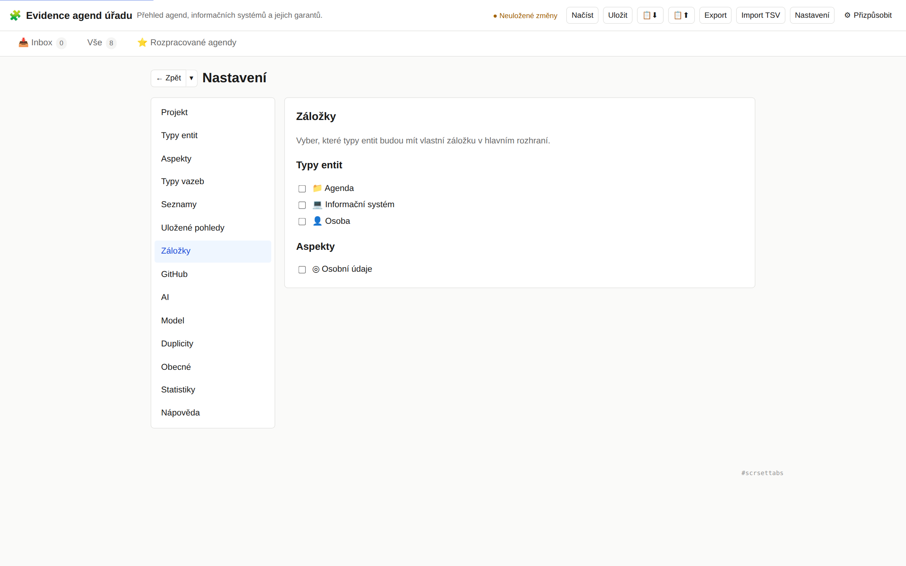

### GitHub

**Nastavení → GitHub.** Místo stahování souborů můžete projekt ukládat rovnou do
repozitáře. Vyplňte osobní přístupový token a cestu k souboru; pak už tlačítko **Uložit**
v hlavičce commituje do GitHubu.

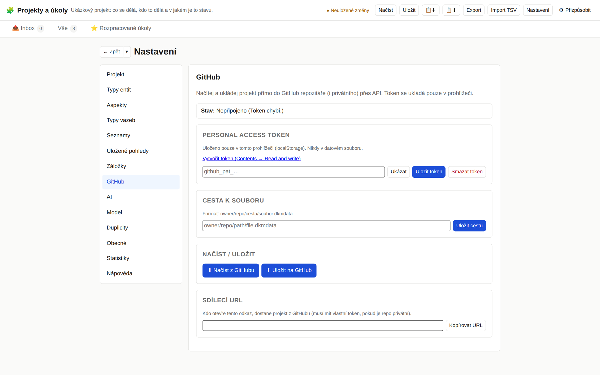

> Token zůstává **jen ve vašem prohlížeči**. Neuloží se do dat projektu ani do odkazu,
> takže se nemůže omylem dostat ven se sdíleným souborem.

### Obecné

**Nastavení → Obecné.** Jazyk (čeština / angličtina), **jméno autora komentářů**,
automatické ukládání a ladicí režim.

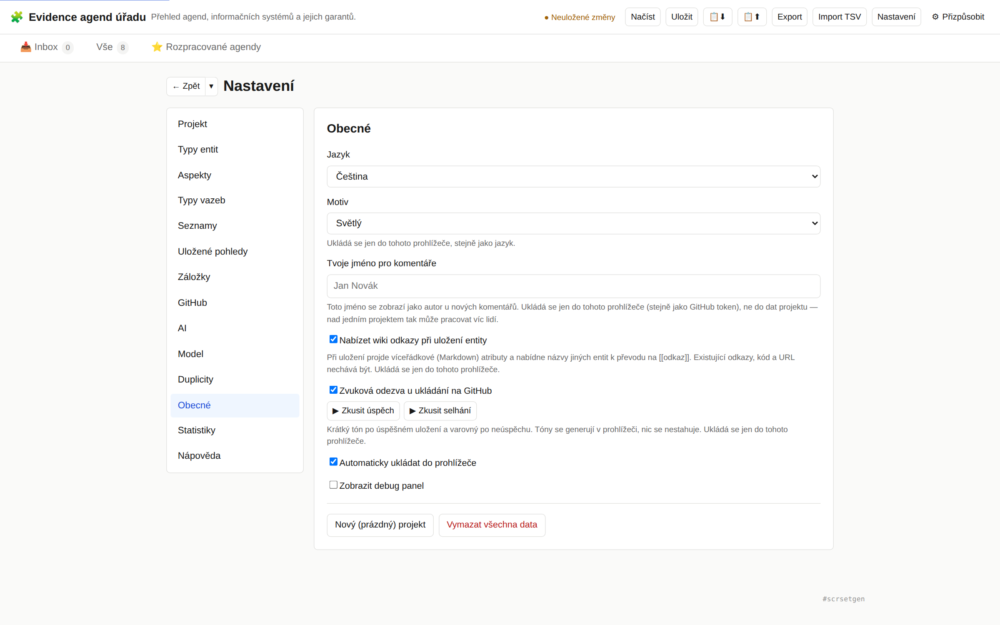

### Statistiky

**Nastavení → Statistiky.** Kolik máte entit, jak jsou rozdělené mezi typy, kolik je
vazeb a komentářů. Dobrý způsob, jak si všimnout, že jeden typ používáte na všechno.

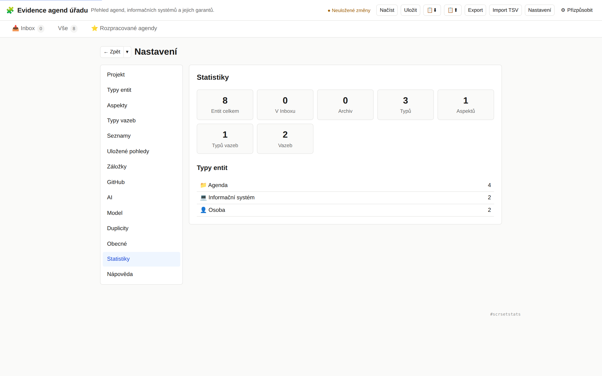

### Datový model a jeho export

**Nastavení → Model.** Vyexportuje **schéma, ne data** — typy, aspekty, atributy,
číselníky a vazby — do osmi formátů (Markdown, OpenAPI, JSON Schema, XSD, SQL, dva
Turtle soubory a XMI pro UML nástroje). Používá se to jako zadání pro navazující systém.

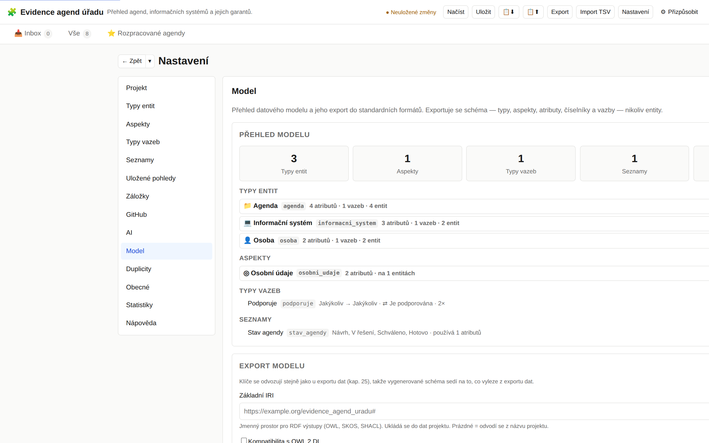

### Projekt

**Nastavení → Projekt.** Kromě názvu a popisu tu je i načtení projektu z adresy, odkaz,
který projekt rovnou otevře, stažení statického prohlížeče, import balíčku a tlačítko
**📄 Začít prázdný projekt**.


---

## 27. Klávesové zkratky

Fungují, když nestojíte v textovém poli.

| Klávesa | Co udělá |
|---|---|
| **N** | nová entita |
| **F** | skok do vyhledávacího pole |
| **V** | zapne nebo vypne režim hromadného výběru |
| **E** | upraví otevřenou entitu |
| **U** | uloží rozeditovanou entitu |
| **Ctrl+P** | rychlá paleta |
| **Ctrl+F** | pokročilé filtry |
| **Ctrl+S** | uloží projekt |
| **Ctrl+Enter** | odešle komentář |
| **Esc** | zavře dialog nebo zruší editaci |
| **I** / **A** | skok na Inbox / na Vše |
| **Q** | rychlé přidání do Inboxu |
| **R** | přidat vazbu (v detailu) |
| **C** | skok do pole pro komentář |
| **Ctrl+K** | skok do hledání |
| **Ctrl+T** / **Ctrl+W** | nový panel / zavřít panel |

Vedle nich fungují **přístupové klávesy**: `Alt+L` načíst, `Alt+S` uložit,
`Alt+N` nová entita, `Alt+A` záložka Vše, `Alt+B` zpět, `Alt+R` přidat vazbu,
`Alt+U` uložit editaci. Ty fungují i v textových polích. Konkrétní kombinaci určuje
prohlížeč — obvykle **Alt**, ve Firefoxu **Alt+Shift**, na macOS **Ctrl+Alt**.

Úplný seznam je v **Nastavení → Nápověda**.

---

## 28. Když se něco nedaří

**„Zmizely mi entity."** Projděte tři možnosti v tomhle pořadí: 1) je zapnutý filtr —
za tlačítkem **⚙ Pokročilé filtry** je číslo v závorce, klikněte na **🗑 Vyčistit
filtry**; 2) stojíte na záložce uloženého pohledu místo na **Vše**; 3) entity jsou
archivované — podívejte se do záložky **Archiv**.

**„Zavřel jsem záložku a projekt je pryč."** Data žijí v záložce prohlížeče. Bez uložení
do souboru (kapitola 18) je obnovit nelze. Zvažte zapnutí automatického ukládání
v **Nastavení → Obecné** nebo ukládání na GitHub.

**„Nemůžu přidat vazbu — nabídka je prázdná."** Typ vazby má nastavený rozsah, který
cílový typ nepovoluje. Otevřete **Nastavení → Typy vazeb** a zkontrolujte povolené typy.

**„V seznamu vidím `**takhle**` místo tučného textu."** Výtah na kartě je záměrně prostý
text — Markdown se vykreslí až v detailu entity.

**„Seznam ukazuje jen sto položek."** Ano, to je pojistka proti zahlcení. Zúžte výběr
filtrem; export a všechny další operace pracují s celým seznamem, ne jen se zobrazenou
stovkou.

**„Kanban má všechno v jednom sloupci."** V rozbalovátku **Sloupce podle** je vybraný
atribut, který dotčené entity nemají vyplněný — nebo ho vůbec nemají. Vyberte atribut
typu *Výběr ze seznamu*, který na daných entitách skutečně je.

---

## Kam dál

- [`docs-cs.md`](../docs-cs.md) — referenční dokumentace se všemi volbami a formáty
- [`screens.md`](../screens.md) — seznam identifikátorů obrazovek
- [`dkmdata-scheme.json`](../dkmdata-scheme.json) — závazný popis formátu projektu
- [`README.md`](README.md) — jak se snímky v této příručce generují
