# Jednoduchý správce úkolů v DKM

**Návod krok za krokem.** Postavíme v DKM evidenci projektů a úkolů s lidmi, kteří za ně
zodpovídají — od prázdné aplikace až po stav, ve kterém se v tom dá opravdu pracovat.
Všechny snímky v tomhle návodu vznikly proklikáním aplikace přesně podle kroků, které tu
čteš; nic na nich není dokreslené.

Hotový projekt si můžeš rovnou načíst ze souboru **`spravce-ukolu.dkmdata`**, který leží
vedle tohohle návodu (v aplikaci **Načíst** → vyber soubor). Smysl návodu je ale v tom si
to jednou postavit sám — pak už víš, kde co změnit.

Vedle leží i **`snimky-navodu.mjs`** — skript, který celý tenhle postup proklikal a pořídil
snímky. Každý snímek se v něm ověřuje proti internímu identifikátoru obrazovky, takže až se
aplikace změní, skript spadne místo toho, aby návod tiše zestárnul. Spustíš ho
`node temp/snimky-navodu.mjs`.

---

## Část I — Nejdřív vysvětlení

### K čemu je DKM a proč to nemá hotové „úkoly"

Většina nástrojů na úkoly přijde s hotovou představou, co úkol je: má název, termín,
prioritu a hotovo/nehotovo. Když potřebuješ něco navíc — *schvalovatele*, *spisovou
značku*, *oddělení* — buď to někam vecpeš, nebo máš smůlu.

**DKM nemá předpřipravený žádný datový model.** Nejdřív si řekneš, co je to u tebe projekt
a co je úkol, a teprve pak začneš plnit data. Tenhle návod je ukázka jednoho takového
rozhodnutí; tvoje může vypadat jinak a bude stejně správné.

### Šest pojmů, které potřebuješ znát

| Pojem | Co to je | V našem správci |
|---|---|---|
| **Entita** | jeden záznam, jedna věc | konkrétní projekt, konkrétní úkol |
| **Typ entity** | šablona atributů pro skupinu entit | `Projekt`, `Úkol` |
| **Atribut** | jedno pole záznamu, má svůj datový typ | *Zadání*, *Stav*, *Termín* |
| **Aspekt** | sada atributů **napříč typy**, přidává se entitě zvlášť | `Zodpovědnost`, `Plánování` |
| **Tag** | značka ze **soustavy tagů**, hodnota atributu typu *tagy* | `Alice Horáková` ze soustavy *Lidé* |
| **Vazba** | pojmenovaný vztah mezi dvěma entitami | *Navazuje na* mezi dvěma úkoly |

### Proč zrovna takhle: tři rozhodnutí, která tu padla

**1. Zodpovědnost je aspekt, ne atribut typu.**
Zodpovědná osoba nepatří jenom k úkolu — projekt má taky svého garanta, a časem to budeš
chtít i u jiných typů (smlouva, žádost, porada). Kdyby *Zodpovídá* bylo atributem typu
`Úkol`, musel bys ho zakládat znovu u každého dalšího typu a filtr „co má na starosti
Alice" by musel prohledávat pět různých polí.

Aspekt tohle řeší: je to **průřezová sada atributů**, kterou přidáš entitě **bez ohledu na
její typ**. Jedna definice, jedno filtrování, jedna sekce v seznamu. Totéž platí pro
`Plánování` (*Termín*, *Priorita*) — termín má smysl u úkolu i u projektu.

> **Kdy aspekt a kdy typ?** Typ odpovídá na otázku „co to je". Aspekt na otázku „co o tom
> navíc evidujeme". Když se tatáž sada polí objevuje u víc typů, je to aspekt.

**2. Zodpovědný je tag, ne entita.**
DKM by zvládlo i typ `Osoba` a vazbu na něj. U správce úkolů to ale znamená, že pro
každého kolegu musíš založit záznam, a pro přiřazení úkolu klikat do výběru entit.
**Tag je rychlejší**: zaškrtneš ho, a když tam někdo chybí, dopíšeš ho rovnou při vyplňování
úkolu — bez odskoku do nastavení. Tag je navíc **značka napříč atributy**: `Alice Horáková`
znamená totéž v poli *Zodpovídá* i *Spolupracuje*, takže sekce „podle lidí" sesype dohromady
všechno, kde se Alice vyskytuje.

> Entitu `Osoba` si pořiď ve chvíli, kdy o lidech potřebuješ evidovat víc než jméno
> (e-mail, útvar, zástup). Do té doby je tag méně práce a víc užitku.

**3. Projekt je u úkolu atribut typu *vazba*, ne tag.**
Protože projekt **je** entita — má svoje zadání, stav a termín. Atribut typu *relace na
entitu* vypadá v editoru jako pole, ale je to plnohodnotná vazba: na projektu se objeví
v kartě *Vazby* („odkazuje sem") a dá se podle ní procházet oběma směry.

### Co z toho bude

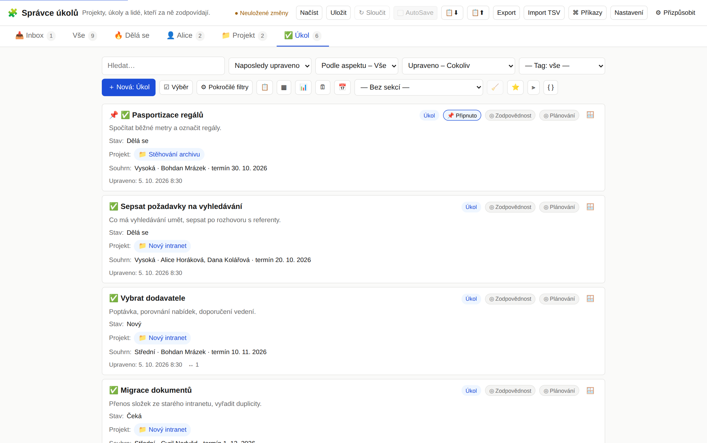

Seznam úkolů, kde na každé kartě vidíš stav, projekt a jednořádkový souhrn
(*priorita · kdo · termín*), nahoře připnutý úkol, vedle toho Kanban podle stavu, sekce
podle lidí, uložený pohled „co se zrovna dělá" a Inbox na nápady, které ještě nejsou úkol.

---

## Část II — Krok za krokem

Aplikace je **jeden HTML soubor**. Otevři `dkm/index.html` v prohlížeči a můžeš začít;
nic se nikam neinstaluje a data zůstávají v prohlížeči, dokud si je neuložíš do souboru.

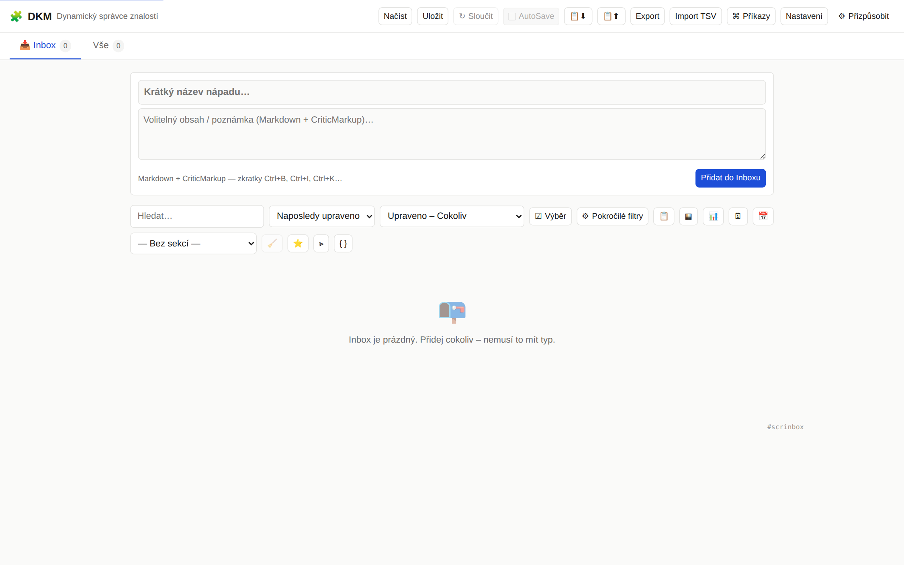

> **Ukládej průběžně.** Vlevo nahoře svítí **● Neuložené změny**. Tlačítkem **Uložit**
> (nebo Ctrl+S) si projekt stáhneš jako soubor `.dkmdata`. Pořadí kroků níž je zvolené tak,
> aby na sebe navazovaly — číselník musí existovat dřív, než ho přiřadíš atributu.

---

### Krok 1 — Pojmenuj projekt

1. V hlavičce klikni na **Nastavení**.
2. V levém sloupci je vybraná sekce **Projekt**.
3. Do pole **Název projektu** napiš `Správce úkolů`.
4. Do **Popis** napiš `Projekty, úkoly a lidé, kteří za ně zodpovídají.`

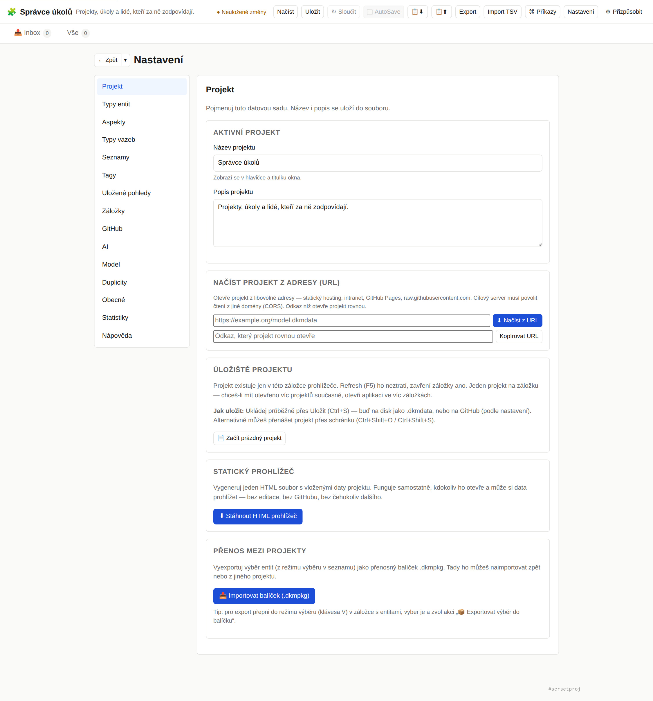

Název se objeví v hlavičce aplikace a v titulku okna — užitečné, až budeš mít otevřených
víc projektů v několika záložkách prohlížeče.

---

### Krok 2 — Číselníky (Nastavení → Seznamy)

Číselník je pojmenovaná zásoba hodnot pro atribut typu *výběr ze seznamu*. Potřebujeme tři.

1. V Nastavení klikni v levém sloupci na **Seznamy**.
2. Klikni na **＋ Přidat seznam**.
3. Do pole **Název** napiš `Stav úkolu`.
4. Do pole **Hodnoty (každá na jednom řádku)** napiš hodnoty, každou na samostatný řádek:

   ```
   Nový
   Dělá se
   Čeká
   Hotovo
   ```
5. Totéž zopakuj ještě dvakrát:
   - `Stav projektu` → `Záměr`, `Běží`, `Pozastaveno`, `Dokončeno`
   - `Priorita` → `Vysoká`, `Střední`, `Nízká`

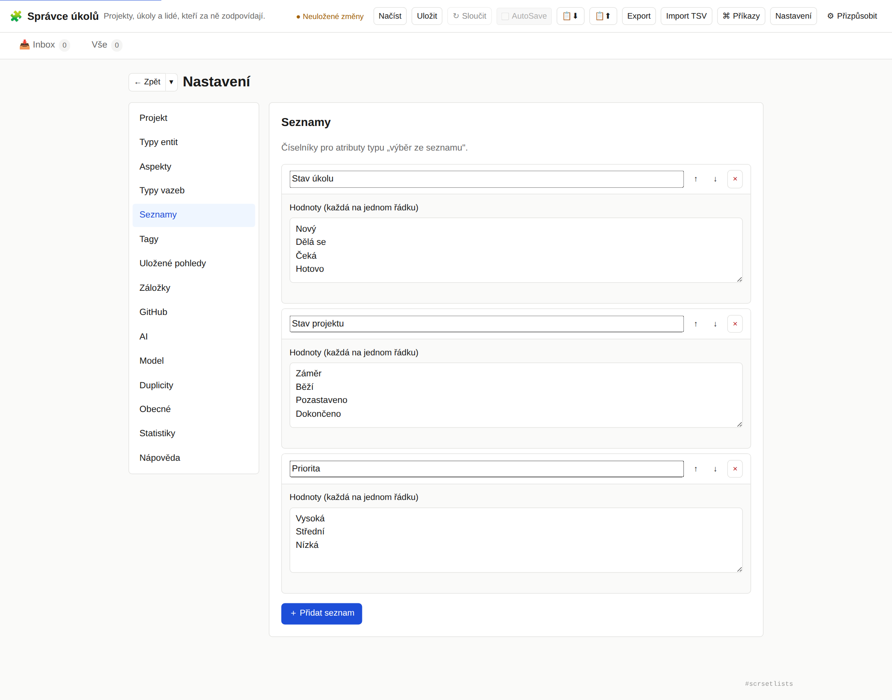

> **Proč oddělený *Stav úkolu* a *Stav projektu*?** Protože se liší a protože podle nich
> budeme stavět Kanban. Jeden společný číselník by znamenal sloupce „Záměr" i u úkolů.

---

### Krok 3 — Soustavy tagů (Nastavení → Tagy)

Soustava tagů je zásoba značek. Atribut typu *tagy* se na jednu soustavu naváže a nabízí
z ní hodnoty.

1. V Nastavení klikni na **Tagy**. Je tu zatím prázdno.

   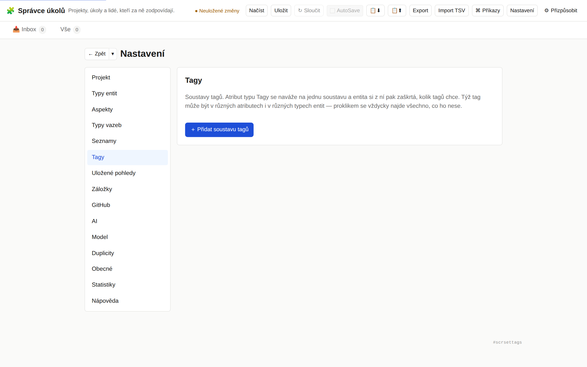

2. Klikni na **＋ Přidat soustavu tagů**.
3. Do pole **Název** napiš `Lidé`.
4. Do pole **Tagy (jeden na řádek)** napiš jména, každé na samostatný řádek:

   ```
   Alice Horáková
   Bohdan Mrázek
   Cyril Nedvěd
   ```
5. Přidej druhou soustavu `Oblast` s hodnotami `IT`, `Právo`, `Komunikace`.

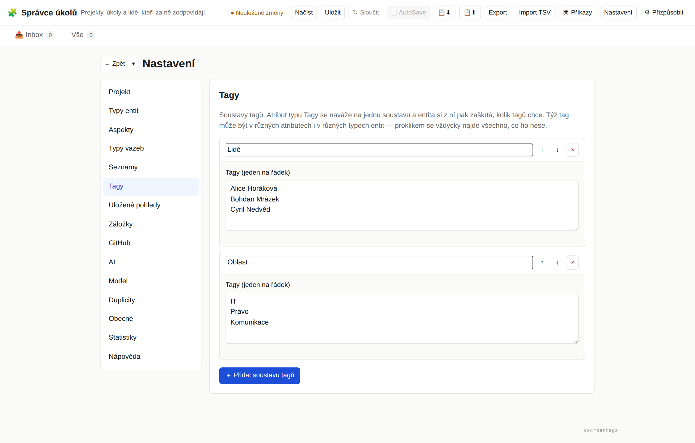

> Nemusíš sem vypsat všechny lidi dopředu. **Tag se dá přidat i při vyplňování úkolu** —
> ukážeme si to v kroku 9. Tady stačí začít s těmi, které znáš.

---

### Krok 4 — Typy entit (Nastavení → Typy entit)

#### 4a. Typ `Projekt`

1. V Nastavení klikni na **Typy entit** → **＋ Přidat typ entity**.
2. Do pole **Ikona** napiš `📁`, do **Název** napiš `Projekt`.

   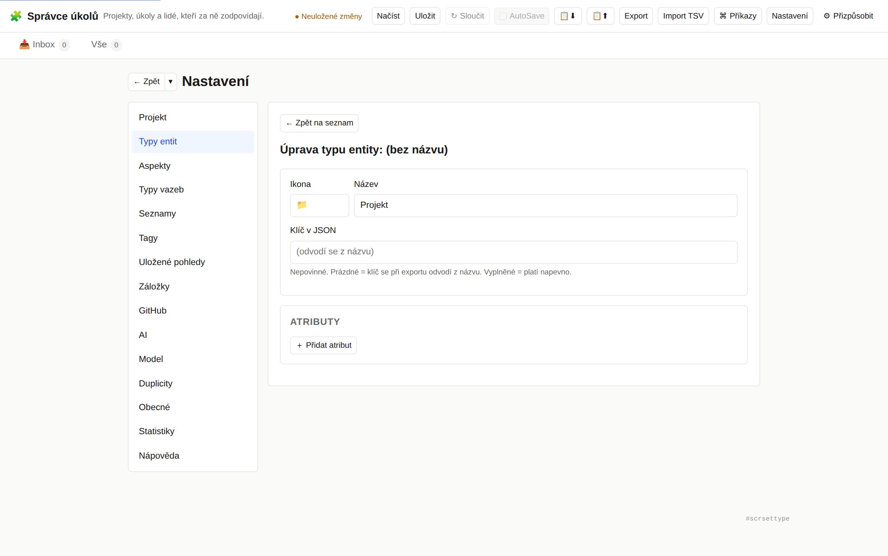

3. Klikni na **＋ Přidat atribut** a vyplň první řádek:
   - **Název atributu**: `Kód`, **typ**: *Text (jeden řádek)*, zaškrtni **Zobrazit v seznamu**
4. Znovu **＋ Přidat atribut**:
   - `Zadání`, typ *Text (víceřádkový, Markdown + CriticMarkup)*
5. Znovu **＋ Přidat atribut**:
   - `Stav`, typ *Výběr ze seznamu*, zaškrtni **Zobrazit v seznamu**, v rozbalovátku
     **Seznam** vyber `Stav projektu`

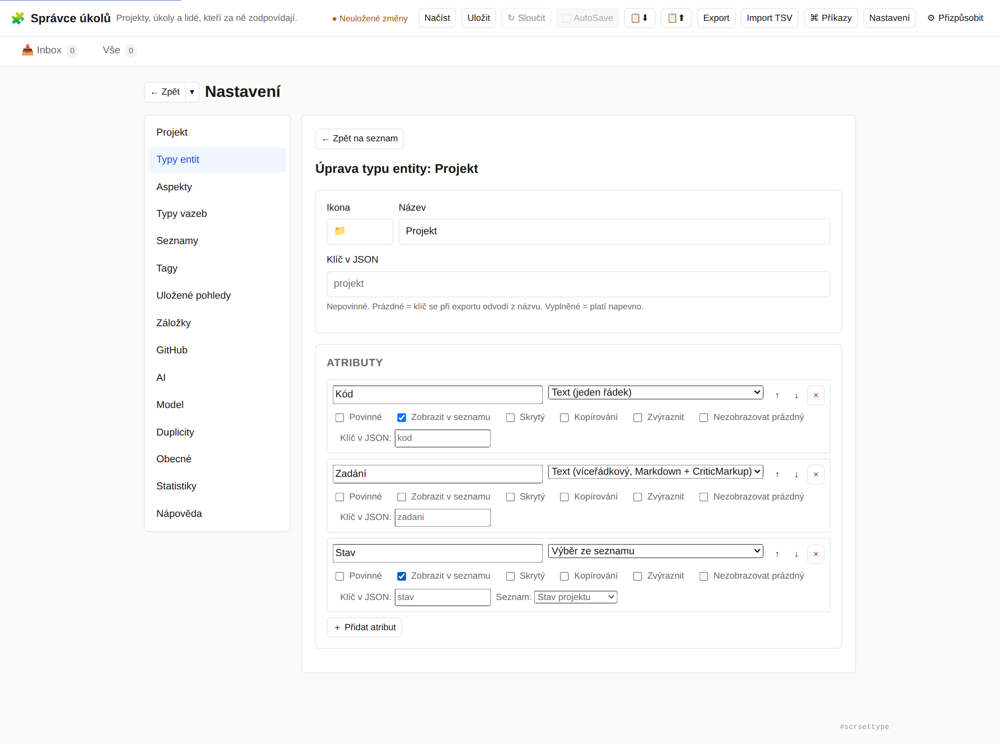

> **„Zobrazit v seznamu"** rozhoduje, jestli se hodnota atributu objeví na kartě entity
> v seznamu. Zaškrtávej jen to, podle čeho se v seznamu orientuješ — jinak z karet bude
> nepřehledná zeď textu.

#### 4b. Typ `Úkol`

1. Klikni na **← Zpět na seznam** a pak znovu **＋ Přidat typ entity**.
2. Ikona `✅`, název `Úkol`.
3. Přidej čtyři atributy:

| Název | Typ atributu | Volby |
|---|---|---|
| `Zadání` | Text (víceřádkový, Markdown) | — |
| `Stav` | Výběr ze seznamu | ✔ Zobrazit v seznamu · Seznam: `Stav úkolu` |
| `Projekt` | Relace na entitu | ✔ Zobrazit v seznamu · Cílový typ entity: `Projekt` |
| `Oblast` | Tagy | Soustava tagů: `Oblast` |

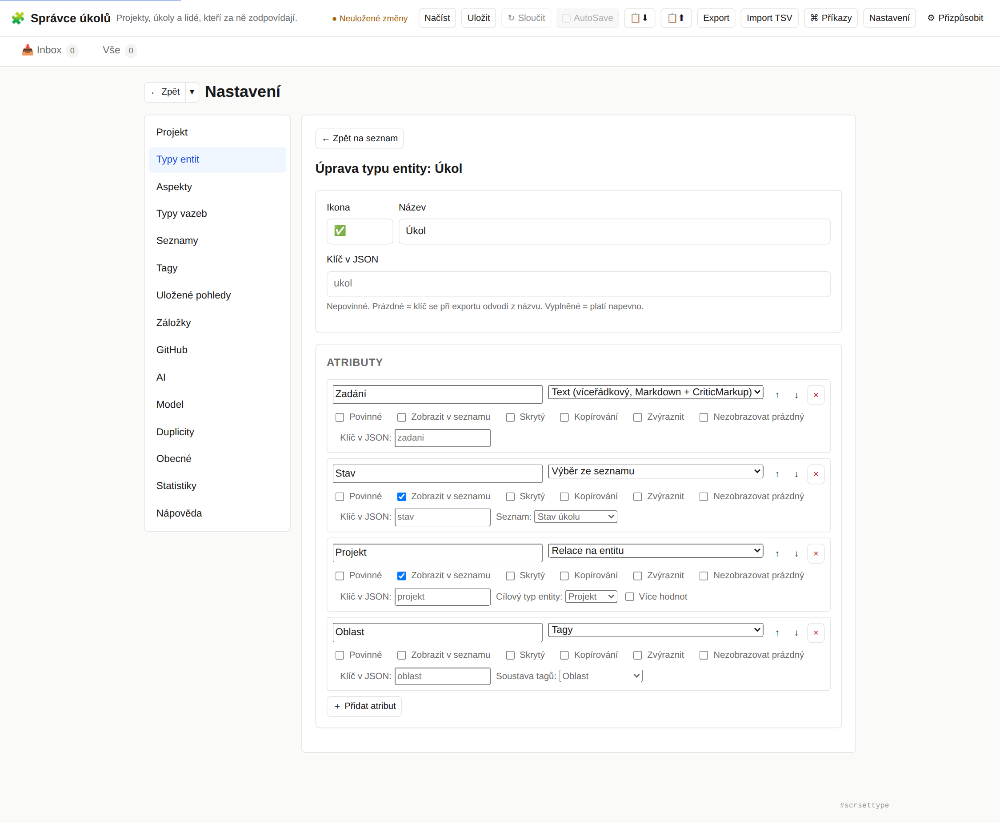

4. **← Zpět na seznam** — teď vidíš oba typy v tabulce.

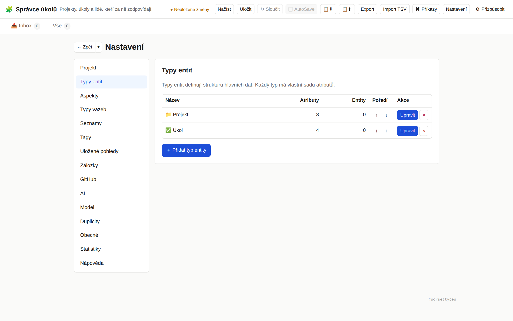

> **Cílový typ entity** u relace omezí nabídku při vyplňování jen na projekty. Bez něj by
> šlo úkol navázat na cokoli, i na jiný úkol.

---

### Krok 5 — Aspekty (Nastavení → Aspekty)

#### 5a. Aspekt `Zodpovědnost`

1. V Nastavení klikni na **Aspekty** → **＋ Přidat aspekt**.
2. Název: `Zodpovědnost`.
3. **＋ Přidat atribut**: `Zodpovídá`, typ *Tagy*, soustava `Lidé`.
4. **＋ Přidat atribut**: `Spolupracuje`, typ *Tagy*, soustava `Lidé`.

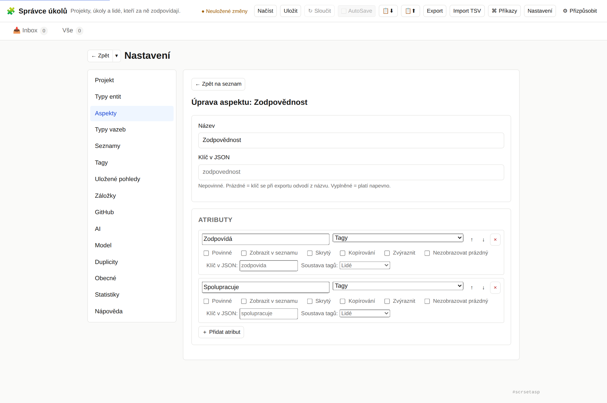

#### 5b. Aspekt `Plánování`

1. **← Zpět na seznam** → **＋ Přidat aspekt**.
2. Název: `Plánování`.
3. Atributy: `Termín` (typ *Datum*) a `Priorita` (typ *Výběr ze seznamu*, seznam `Priorita`).

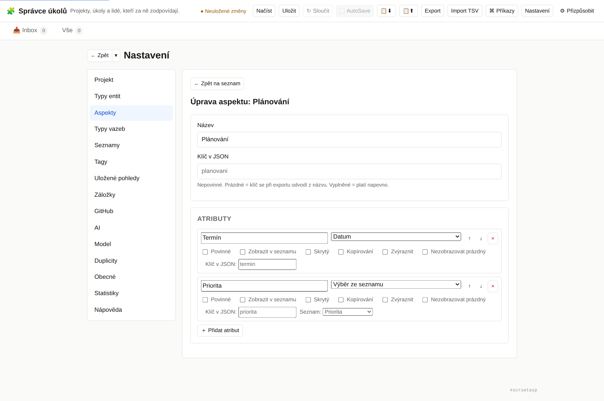

4. **← Zpět na seznam**.

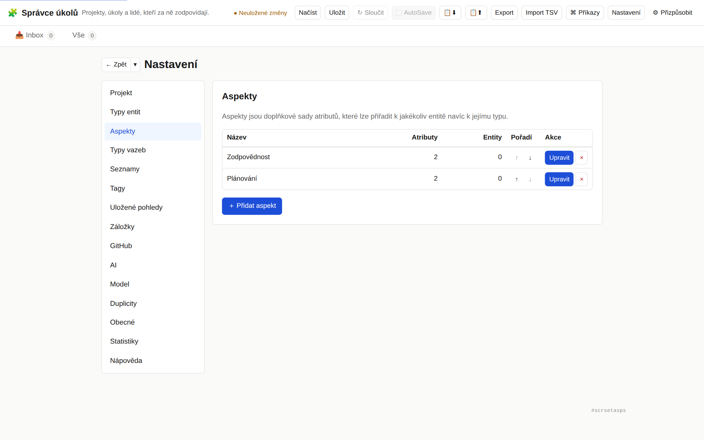

> Všimni si, že **aspekt se nikam „nepřiřazuje"**. Jen existuje. Přidáš ho konkrétní entitě
> až v jejím editoru — a tím jí přibudou jeho atributy. Jeden úkol tak může mít termín
> a druhý ne, aniž bys měl v seznamu sloupec plný prázdna.

---

### Krok 6 — Typ vazby (Nastavení → Typy vazeb)

Vazba se hodí tam, kde vztah není „pole formuláře", ale samostatný fakt. U úkolů je to
**návaznost**: tohle nemůže začít, dokud není hotové tamto.

1. V Nastavení klikni na **Typy vazeb** → **＋ Přidat typ vazby**.
2. **Název**: `Navazuje na`.
3. **Opačný název**: `Předchází` — tím se vazba popíše i z druhé strany.
4. **Rozsah** přepni na *Specifický (od typu na typ)* a v obou seznamech, které se objeví
   (**Od typů** a **Na typy**), zaškrtni `Úkol`.

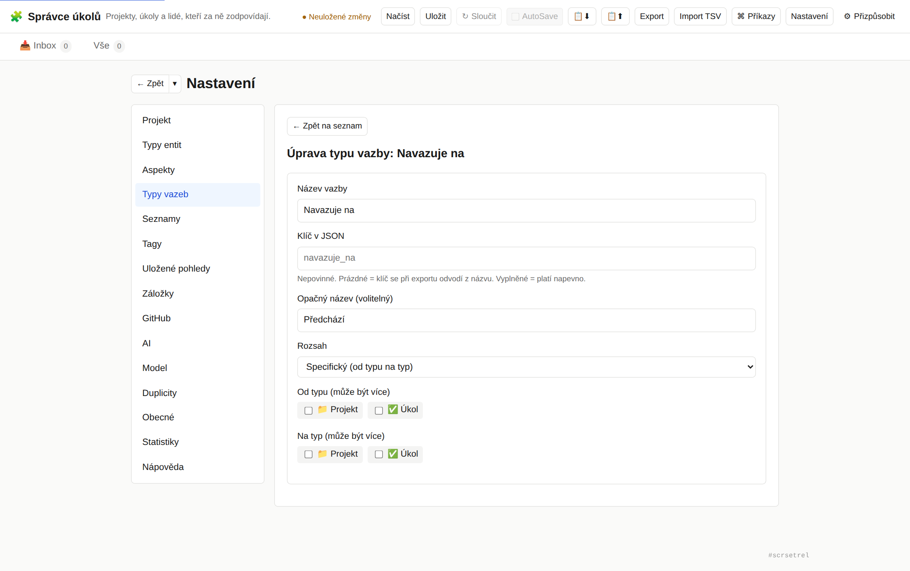

> **Opačný název není kosmetika.** Na druhé entitě se vazba zobrazí v kartě *Vazby* právě
> pod ním. Bez něj by u předchozího úkolu stálo „Navazuje na", což je naopak.

---

### Krok 7 — Souhrn: atribut, který se počítá sám

Tohle je vylepšení, které na kartě úkolu udělá největší službu. **Složený atribut** nemá
vlastní hodnotu — skládá se ze šablony z hodnot ostatních atributů při každém vykreslení.

1. Jdi do **Nastavení → Typy entit** a u typu `Úkol` klikni na **Upravit**.
2. **＋ Přidat atribut**: název `Souhrn`, typ **Složený**.
3. Zaškrtni **Zobrazit v seznamu**.
4. Do pole **Šablona (Markdown s ((pole)))** napiš:

   ```
   ((Priorita)) · ((Zodpovídá)) · termín ((Termín))
   ```

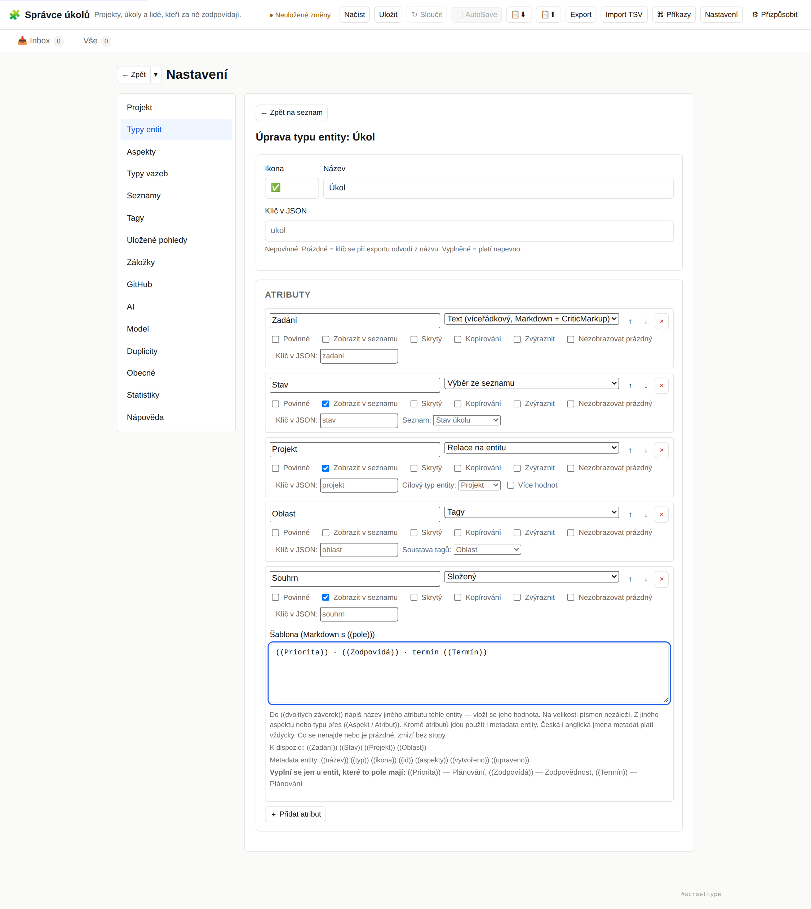

Výsledek na kartě pak vypadá takhle: `Vysoká · Alice Horáková, Dana Kolářová · termín 20. 10. 2026`.

> **Jak to funguje.** Do `((dvojitých závorek))` se píše název jiného atributu téže entity —
> na velikosti písmen nezáleží a může jít i o atribut z aspektu, jako tady. Pod polem se
> průběžně vypisuje, co se našlo a co ne.
>
> **Dvě věci, které je dobré vědět dopředu:**
> - Hodnota se **nikam neukládá**, počítá se při každém zobrazení. Nejde ji tedy naimportovat
>   z tabulky a nenajdeš ji v datovém exportu — a hlavně se sama opraví, když změníš zdroj.
> - Co je prázdné, **zmizí beze stopy — ale oddělovače zůstanou**. U úkolu bez termínu
>   zbyde na konci osiřelé „termín". Buď počítej s tím, že ta pole vyplňuješ, nebo si
>   šablonu napiš bez pevných spojek.

---

### Krok 8 — První projekt

1. V liště nahoře klikni na záložku **Vše**.
2. Klikni na **+ Nová entita**. Otevře se nabídka typů.

   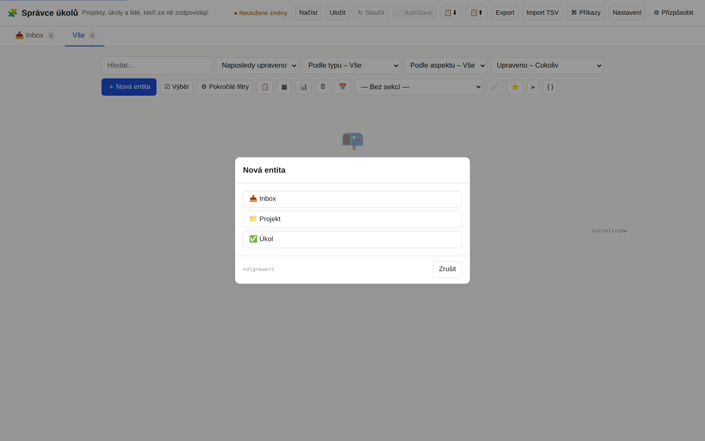

3. Klikni na **📁 Projekt**. Otevře se prázdný editor.

   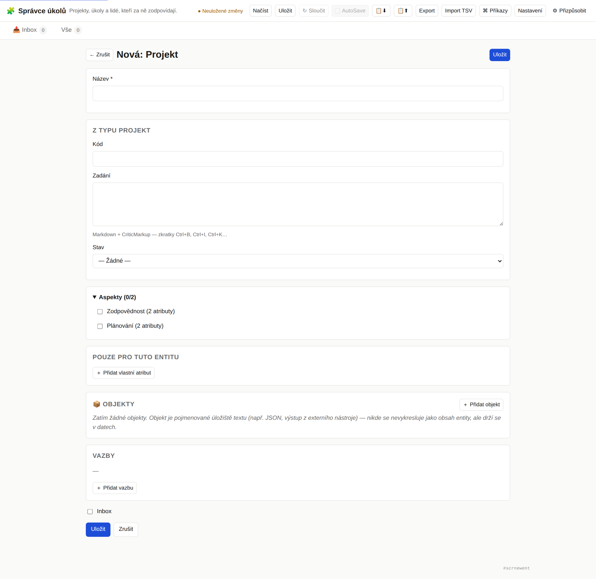

4. Vyplň:
   - **Název**: `Nový intranet`
   - **Kód**: `P-01`
   - **Zadání**: `Nahradit starý intranet. Cílem je, aby **lidé našli dokument do minuty**.`
   - **Stav**: `Běží`

   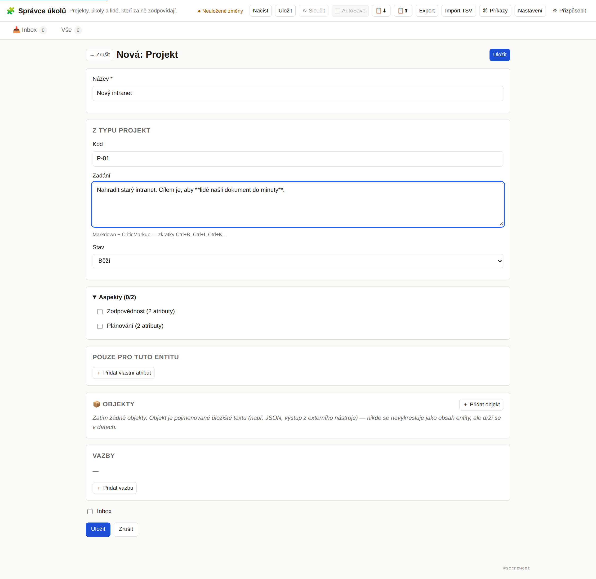

5. Klikni na **Uložit** (nebo Alt+U).

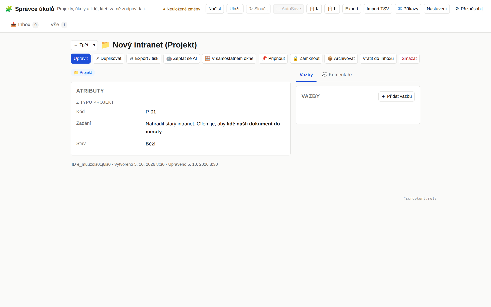

6. Stejným postupem založ druhý projekt: `Stěhování archivu`, kód `P-02`, zadání
   `Přesun papírového archivu do nového depozitáře.`, stav `Záměr`.

> **Zadání je markdownové pole.** `**tučně**`, odrážky, odkazy i `[[wiki odkaz na jinou
> entitu]]` v něm fungují. Nápovědu ke zkratkám máš přímo pod polem.

---

### Krok 9 — První úkol: aspekty, vazba na projekt a tagy

Tohle je nejdůležitější krok celého návodu — poprvé se tu potkají všechny tři mechanismy.

1. Záložka **Vše** → **+ Nová entita** → **✅ Úkol**.
2. Do **Název** napiš `Sepsat požadavky na vyhledávání`.

   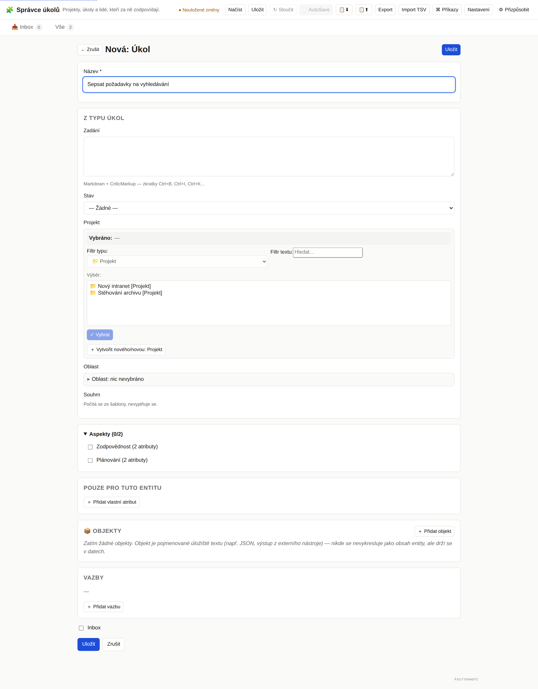

   Zatím vidíš jen atributy typu `Úkol` (sekce *Z TYPU ÚKOL*). Termín, priorita ani
   zodpovědný tu nejsou — ty jsou v aspektech.

3. Sjeď dolů k sekci **Aspekty (0/2)** — je pod atributy, hned nad *Pouze pro tuto entitu*.
   Zaškrtni **Zodpovědnost (2 atributy)** i **Plánování (2 atributy)**.

   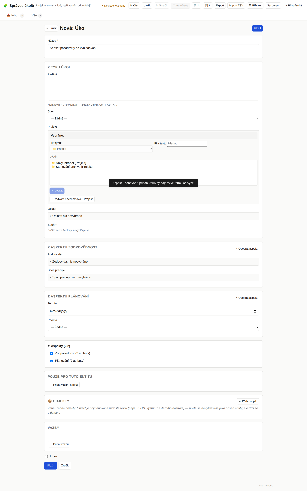

   Formulář se hned rozšířil o dvě nové sekce — *Z ASPEKTU ZODPOVĚDNOST* (pole *Zodpovídá*
   a *Spolupracuje*) a *Z ASPEKTU PLÁNOVÁNÍ* (*Termín*, *Priorita*). U každé je vpravo
   **× Odebrat aspekt**, kdyby sis to rozmyslel.

   Všimni si taky řádku **Souhrn** — místo pole je tam jen poznámka *„Počítá se ze šablony,
   nevyplňuje se."* Přesně tak má složený atribut vypadat.

4. Vyplň zbytek:
   - **Zadání**: `Co má vyhledávání umět, sepsat po rozhovoru s referenty.`
   - **Stav**: `Dělá se`
   - **Projekt**: tohle není obyčejné rozbalovátko, ale výběr entity — v seznamu nabídek
     klikni na `📁 Nový intranet` a potvrď tlačítkem **Vybrat** pod ním
   - **Termín**: `20. 10. 2026`
   - **Priorita**: `Vysoká`

5. **Tagy.** Klikni na řádek **Zodpovídá: nic nevybráno** — rozbalí se nabídka tagů
   ze soustavy *Lidé*.

   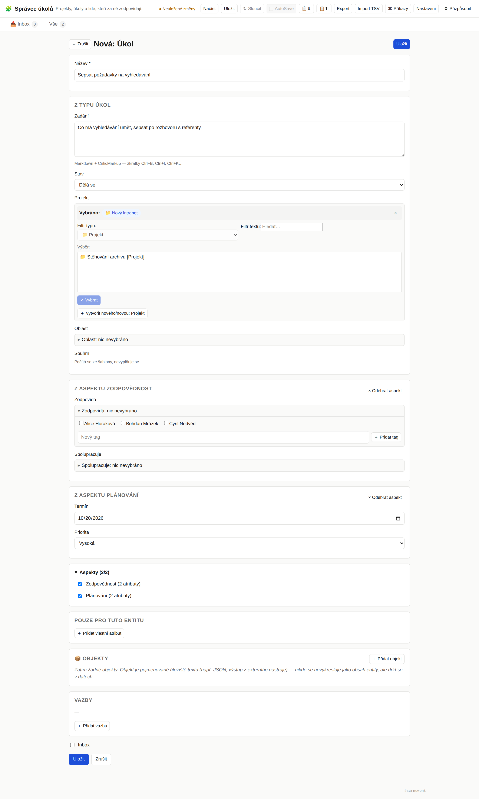

6. Zaškrtni **Alice Horáková**.

7. **A teď to, kvůli čemu jsou tagy rychlé:** do pole **Nový tag** dole napiš
   `Dana Kolářová`.

   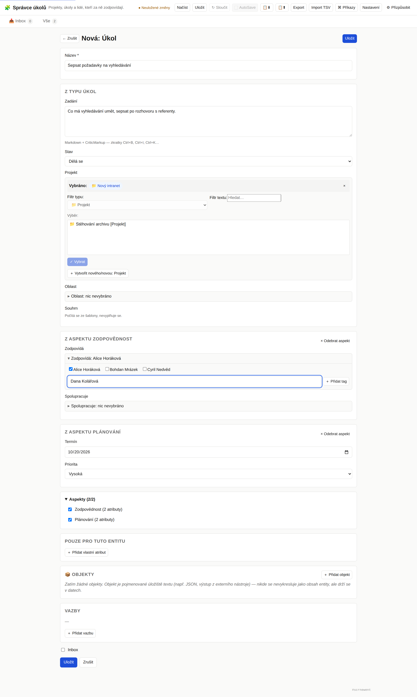

8. Klikni na **＋ Přidat tag**. Tag se **založí v soustavě *Lidé*, rovnou se zaškrtne** u téhle
   entity a od teď ho nabízí všude jinde — aniž bys odešel z rozdělaného úkolu.

   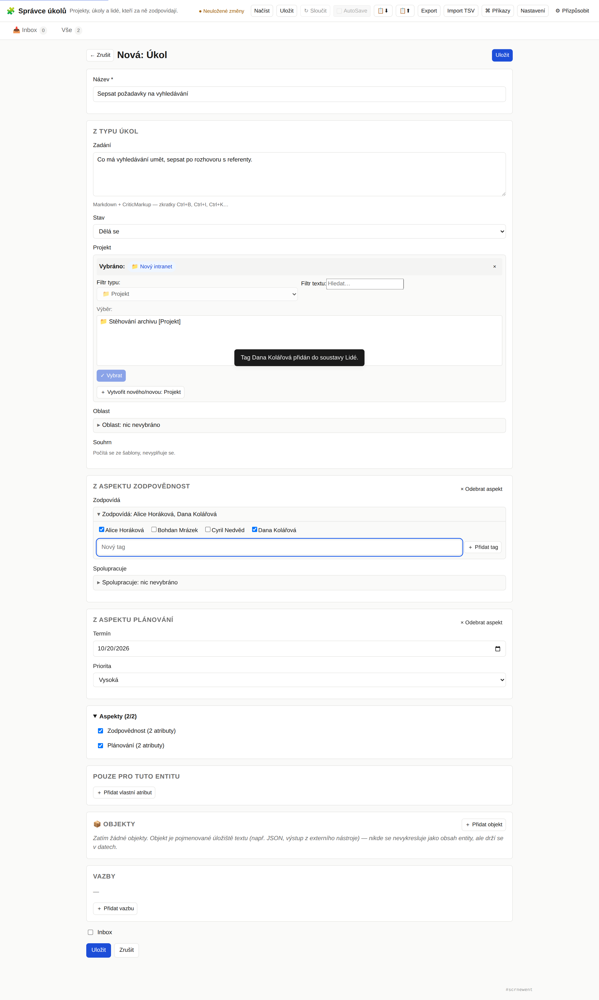

9. Stejným způsobem zaškrtni v poli **Oblast** hodnotu `IT`.
10. **Uložit**.

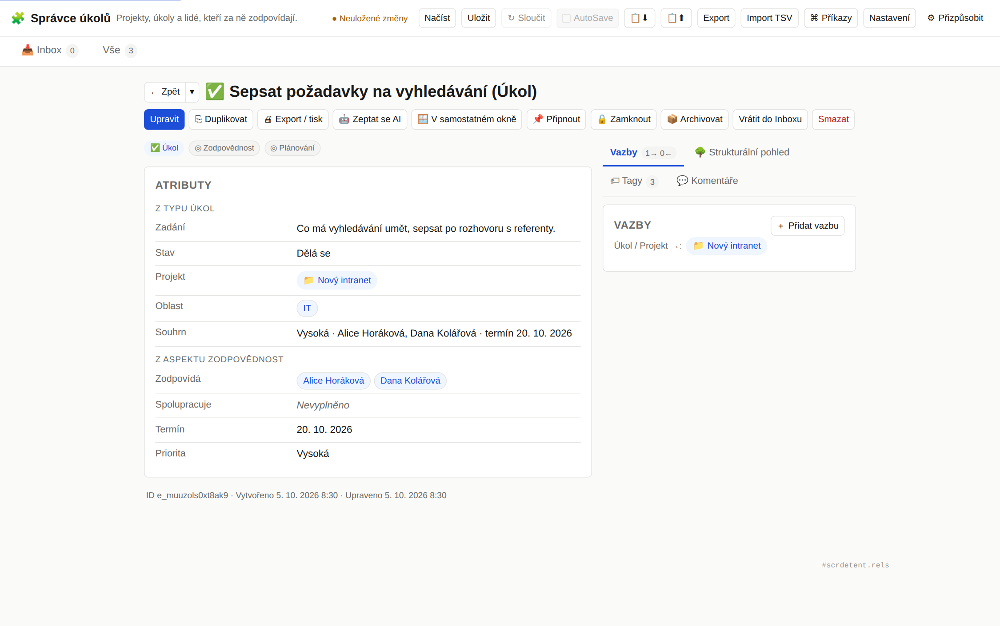

Na detailu si všimni tří věcí:

- Atributy jsou **rozdělené podle původu**: *Z TYPU ÚKOL* a *Z ASPEKTU ZODPOVĚDNOST*. Je
  tedy vždycky vidět, odkud které pole je.
- **Souhrn** se vyplnil sám: `Vysoká · Alice Horáková, Dana Kolářová · termín 20. 10. 2026`.
- Vpravo v kartě **Vazby** přibyl řádek `Úkol / Projekt →: 📁 Nový intranet`. Vazební
  atribut je plnohodnotná vazba — na projektu ji uvidíš z druhé strany.

---

### Krok 10 — Zbytek dat

Stejným postupem (krok 9) založ dalších pět úkolů. U všech zaškrtni oba aspekty.

| Název | Stav | Projekt | Termín | Priorita | Zodpovídá | Oblast |
|---|---|---|---|---|---|---|
| Vybrat dodavatele | Nový | Nový intranet | 10. 11. 2026 | Střední | Bohdan Mrázek | Právo |
| Migrace dokumentů | Čeká | Nový intranet | 1. 12. 2026 | Střední | Cyril Nedvěd *(spolupracuje Alice Horáková)* | IT |
| Školení referentů | Nový | Nový intranet | 15. 12. 2026 | Nízká | Dana Kolářová | Komunikace |
| Pasportizace regálů | Dělá se | Stěhování archivu | 30. 10. 2026 | Vysoká | Bohdan Mrázek | — |
| Smlouva s depozitářem | Hotovo | Stěhování archivu | 30. 9. 2026 | Střední | Dana Kolářová | Právo |

Pak klikni na záložku **Vše**:

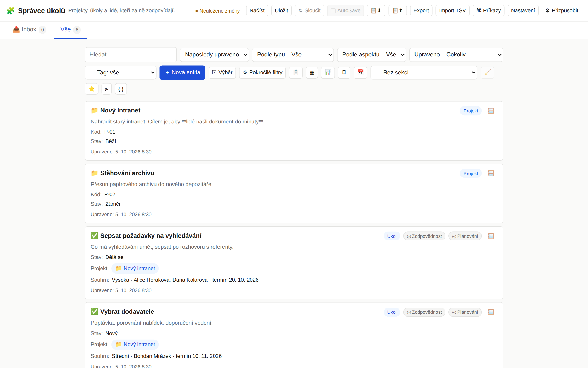

---

### Krok 11 — Vazba mezi úkoly

Dodavatele nemá smysl vybírat dřív, než jsou sepsané požadavky. Zapišme to.

1. Otevři úkol **Vybrat dodavatele**.
2. V kartě **Vazby** vpravo klikni na **＋ Přidat vazbu** (nebo stiskni `r`).
3. V rozbalovátku **Typ vazby** vyber `Navazuje na`.
4. Ve výběru entit najdi `Sepsat požadavky na vyhledávání`.

   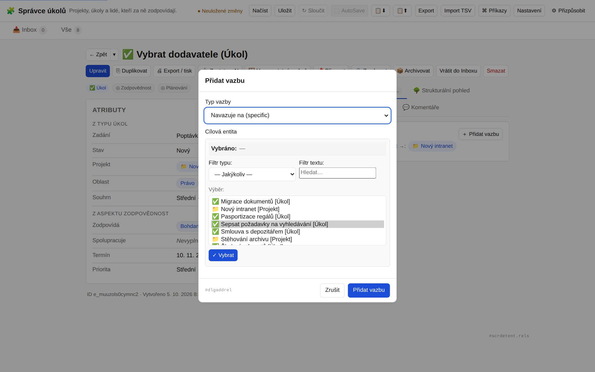

5. Potvrď tlačítkem **Přidat vazbu**.

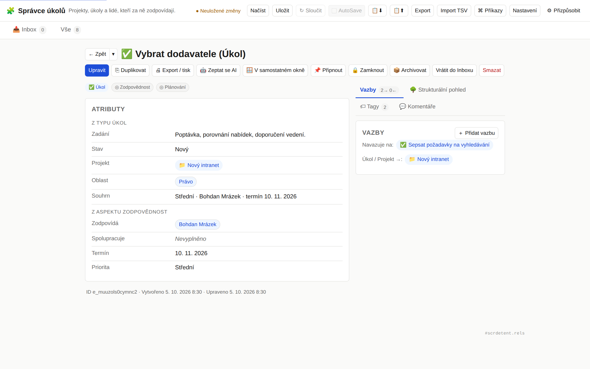

Na úkolu *Sepsat požadavky* teď v kartě *Vazby* najdeš opačnou stranu pod názvem
**Předchází**.

---

### Krok 12 — Jak se na to dívat

Data jsou zapsaná jednou, dívat se na ně můžeš několika způsoby. Všechno, co následuje,
najdeš v liště nad seznamem.

#### 12a. Sekce podle lidí

1. Záložka **Vše**.
2. V rozbalovátku **— Bez sekcí —** vyber **Sekce podle: 🏷 Lidé**.

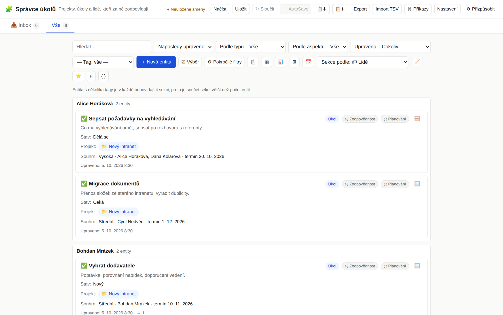

Seznam se rozpadne do rozbalovacích skupin po jménech. **Jeden úkol může být ve víc
sekcích** — kdo je u *Migrace dokumentů* zodpovědný a kdo spolupracuje, to oba spadne
pod své jméno. Tak je tag myšlený: je to značka napříč atributy, ne hodnota jednoho pole.

> Podle **vazby** (tedy podle projektu) seskupovat nejde — sekce staví na atributech typu
> *výběr*, *ano/ne*, *datum* a *tagy*. Když chceš seznam po projektech, použij filtr
> podle projektu, nebo si z něj udělej uložený pohled (krok 12c).

#### 12b. Kanban podle stavu

1. V liště klikni na ikonu **📊 Kanban**.
2. V rozbalovátku **Sloupce podle** vyber **Úkol / Stav**.

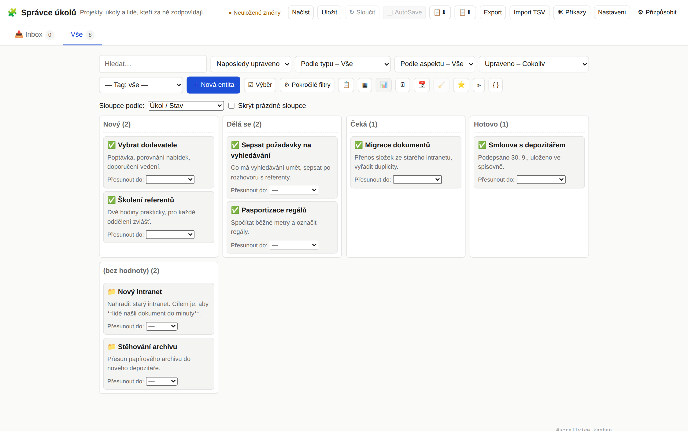

Karty se dají **přetáhnout do jiného sloupce** a tím se přepíše hodnota atributu *Stav*.
Na kartě je k tomu i nabídka **Přesunout do** — přetahování nefunguje na dotyku ani
z klávesnice, nabídka ano.

#### 12c. Filtr a uložený pohled

1. Vrať se na **Seznam** (ikona 📋).
2. Klikni na **⚙ Pokročilé filtry** → **＋ Přidat pravidlo**.
3. **Atribut**: `Úkol / Stav`, **Operátor**: *rovná se* (je přednastavený),
   **Hodnota**: `Dělá se`.

   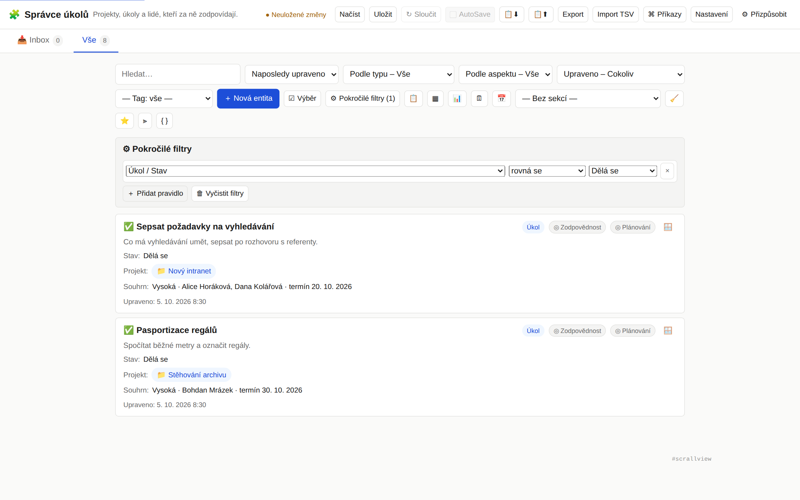

4. Klikni na **⭐** v liště (**Uložit jako pohled**).
5. Pojmenuj ho `Rozdělané` a ulož.

   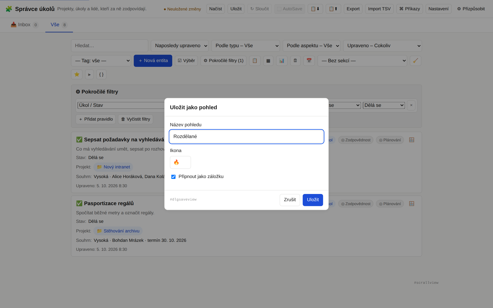

Uložený pohled si pamatuje **filtr i způsob zobrazení** — když ho uložíš v Kanbanu, otevře
se v Kanbanu.

> **Zaškrtávátko „Připnout jako záložku" je v dialogu zapnuté.** Pohled proto hned naskočí
> do lišty nahoře jako nová záložka. V dalším kroku si ji upravíme — nezakládej ji tedy
> znovu ručně.

---

### Krok 13 — Záložky: vytvoření i úprava

Lišta nahoře **není napevno**. Inbox, Vše i Archiv jsou obyčejné položky, které jdou
přejmenovat, přesunout i smazat — a přidat si místo nich ty, které opravdu používáš.

1. **Nastavení → Záložky.** Takhle vypadá lišta po předchozích krocích: tři výchozí položky
   a čtvrtá, kterou právě založil dialog *Uložit pohled*.

   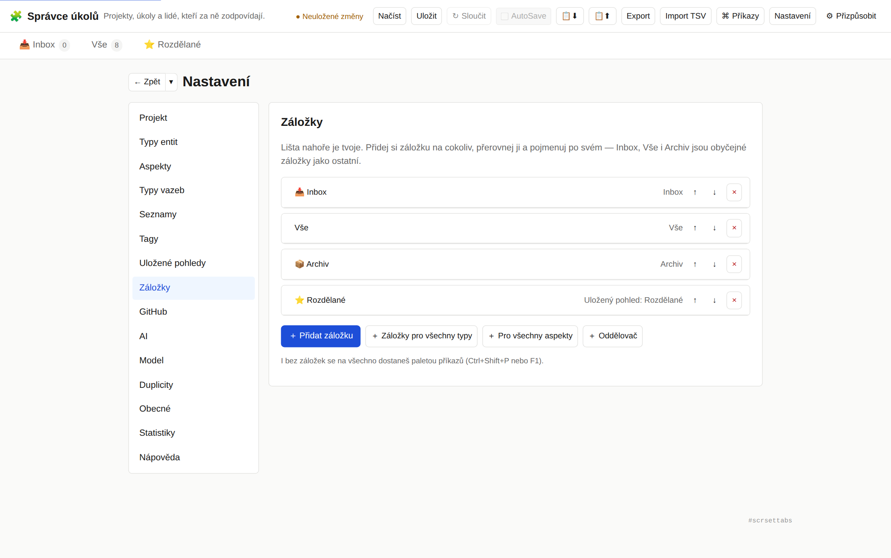

#### 13a. Úprava existující záložky

Záložku pro pohled *Rozdělané* už máme, jen nevypadá, jak by měla.

2. Klikni na její název — řádek se rozbalí.
3. Do pole **Ikona** napiš `🔥`, do pole **Název na liště** napiš `Dělá se`.
   Obojí je nepovinné: prázdné pole se doplní podle cíle záložky (tedy „Rozdělané").
4. Zaškrtni **Otevírat na této**. Aplikace se od teď po načtení projektu otevře rovnou tady.

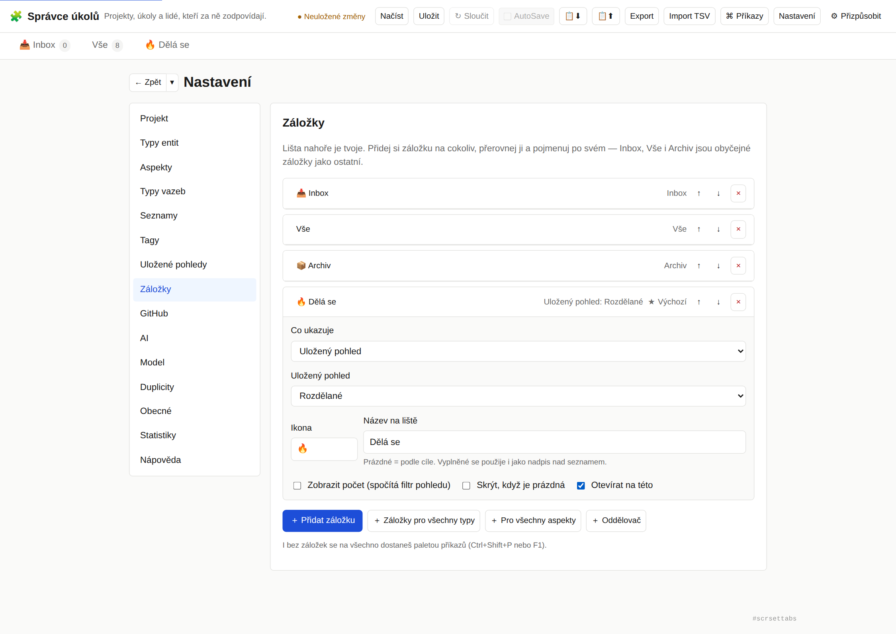

#### 13b. Nová záložka od nuly — na jednoho člověka

Tahle je pro toho, kdo si hlídá hlavně svoje úkoly.

5. Klikni na **＋ Přidat záložku**. Přibude na konci a rovnou se rozbalí.
6. **Co ukazuje** přepni na `Tag`.
7. V rozbalovátku pod tím vyber `Lidé / Alice Horáková`.
8. **Ikona**: `👤`, **Název na liště**: `Alice`.

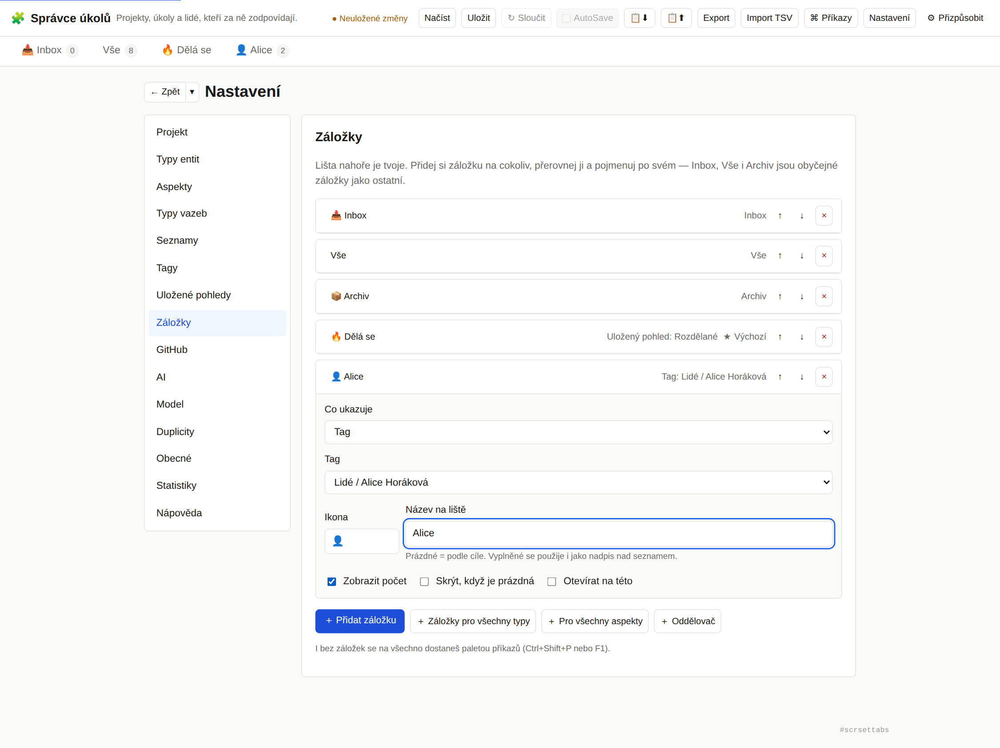

#### 13c. Záložky pro typy jedním tlačítkem

9. Klikni na **＋ Záložky pro všechny typy**. Přibudou `📁 Projekt` a `✅ Úkol`, obě
   i s ikonou typu.

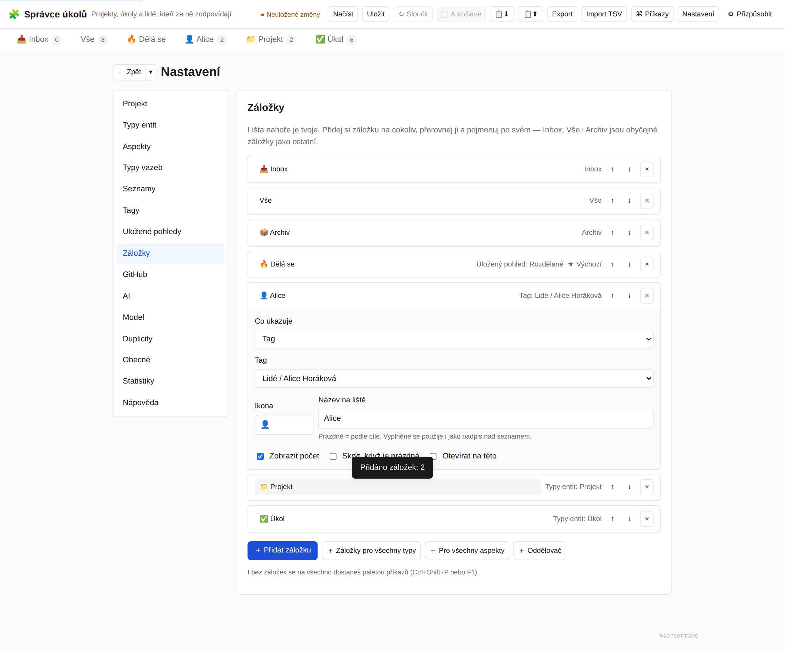

> **Pořadí** změníš šipkami ↑↓ u každého řádku (nebo přetažením za řádek). Pro vizuální
> předěl v liště slouží **＋ Oddělovač**. Na záložky vedou zkratky **Alt+1** až **Alt+9**
> podle pořadí, a u každé se dá vypnout počítadlo nebo nastavit, aby se při nule skrývala
> (to má ve výchozím stavu zapnutý Archiv).

### Krok 14 — Připnutí a zámek

Dvě drobnosti, které se v praxi hodí víc, než se zdá.

**📌 Připnout** vytáhne entitu v každém pohledu dopředu — i uvnitř sekcí a sloupců Kanbanu.
Hodí se na to, co máš zrovna rozdělané.

1. Otevři úkol **Pasportizace regálů**.
2. Klikni na **📌 Připnout**.

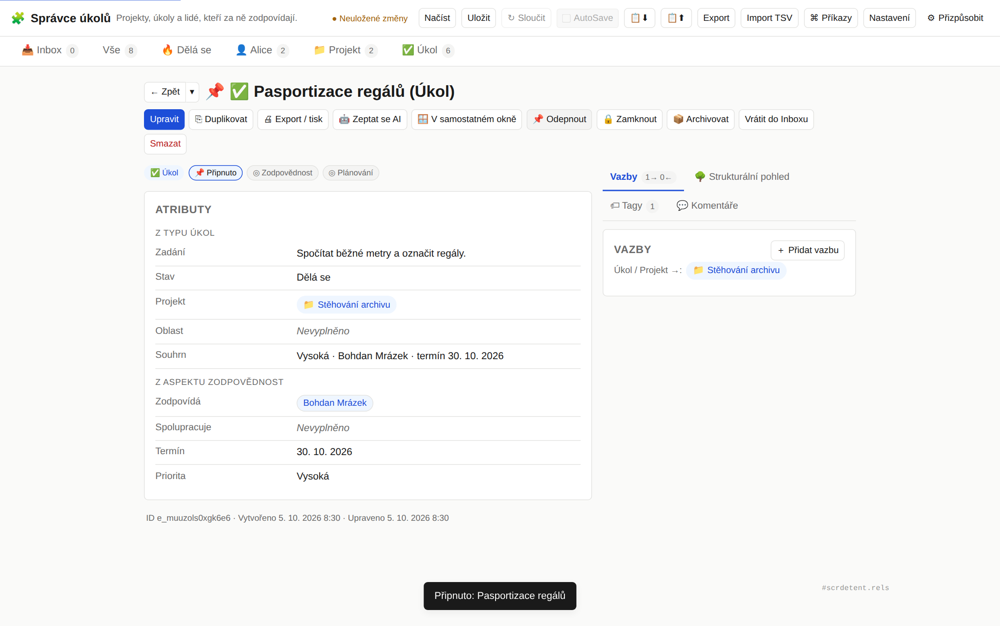

**🔒 Zamknout** udělá z entity hotový záznam: nejde upravit, smazat, archivovat ani přepsat
importem. Komentovat ji jde dál.

3. Otevři **Smlouva s depozitářem** (stav *Hotovo*) a klikni na **🔒 Zamknout**.

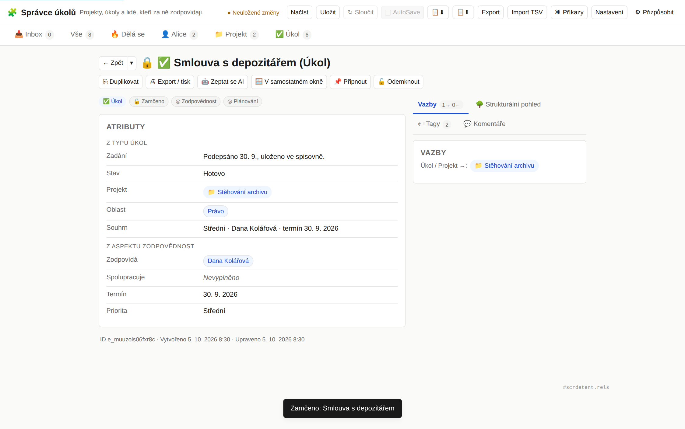

Všimni si, že u zamčené entity **zmizelo tlačítko Upravit** — zakázané tlačítko, na které
se dá klikat jen proto, aby řeklo ne, je horší než žádné. V seznamu obě entity poznáš podle
📌 a 🔒 hned na začátku nadpisu.

> Ani připnutí, ani zamknutí **nemění datum úpravy**. Padesát uzavřených záznamů ti tedy
> nevyskočí nahoru v „Naposledy změněných".

---

### Krok 15 — Inbox

Nápad, který ještě není úkol, nemá smysl protlačovat celým formulářem. Na to je **Inbox**.

1. Klikni na záložku **Inbox**.
2. Do pole **Název** napiš `Zjistit, kdo schvaluje nákup licencí`.
3. Do pole pod ním připiš poznámku.

   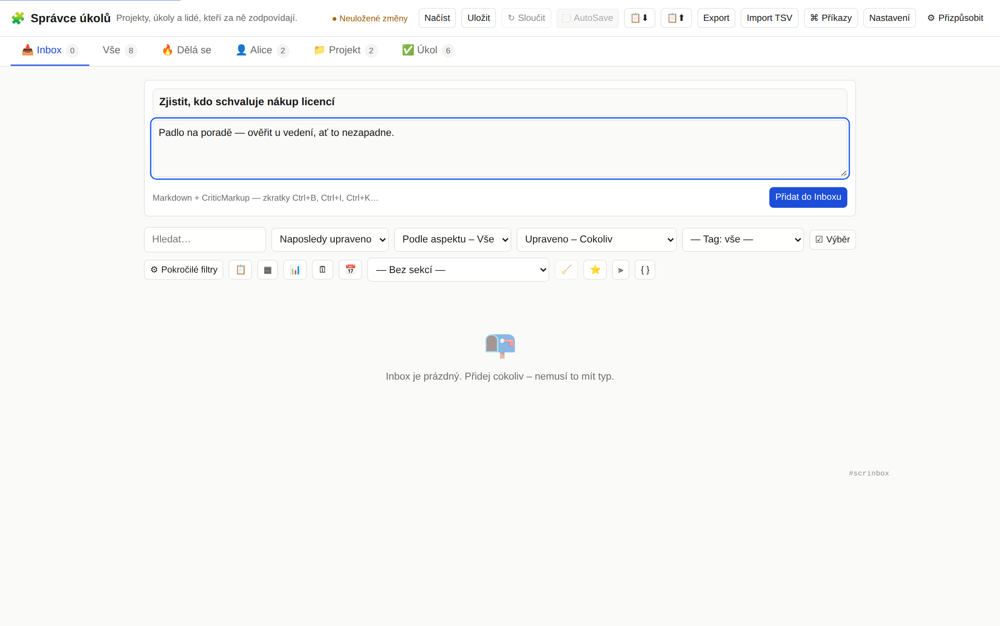

4. Klikni na **Přidat do Inboxu** (nebo Ctrl+Enter).

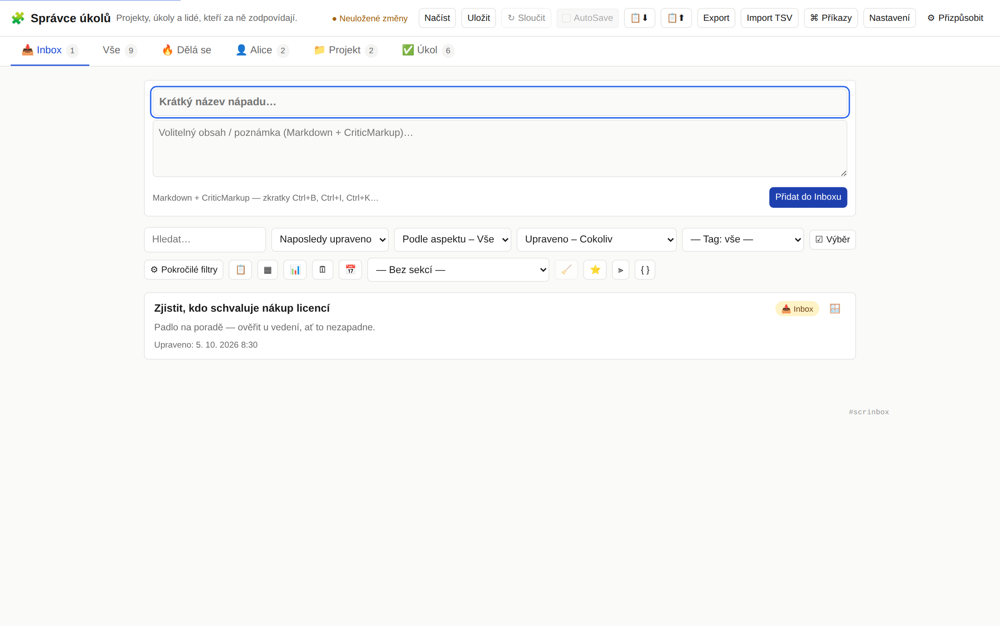

Položka v Inboxu **nemá typ**. Až se ukáže, že je to úkol, otevřeš ji a klikneš na
**Přidělit typ** — tím se z ní stane plnohodnotný `Úkol` se vším všudy.

---

### Krok 16 — Ulož si to

1. Klikni na **Uložit** v hlavičce (Ctrl+S). Stáhne se soubor `.dkmdata`.
2. Zpátky ho dostaneš tlačítkem **Načíst**.

> **Chceš s tím pracovat ve víc lidech?** V *Nastavení → GitHub* se dá projekt napojit na
> soubor v repozitáři. DKM pak cizí změny **slučuje samo** a neptá se — zeptá se jen tehdy,
> když opravdu nastal spor. To už je ale jiný návod; pro jednoho člověka stačí soubor.

---

## Část III — Kam to posunout dál

Co je postavené výš, je záměrně nejmenší rozumný správce úkolů. Tady je, čím ho rozšířit,
až ti začne být těsný — seřazené podle poměru užitku a práce.

| Vylepšení | Jak na to | Kdy se vyplatí |
|---|---|---|
| **Pohled „Po termínu"** | Pokročilé filtry: `Plánování / Termín` *je v minulosti* **a** `Úkol / Stav` *nerovná se* `Hotovo` → ⭐ | Jakmile je úkolů víc než dvacet |
| **Aspekt `Schválení`** | Atributy *Schválil* (tagy → Lidé) a *Schváleno dne* (datum) | Když úkol prochází schvalováním |
| **Kalendář** | V liště ikona 🗓, datum se bere z atributu *Termín* | Když plánuješ podle dnů |
| **Typ `Osoba`** | Místo tagů vazba na entitu | Až budeš o lidech evidovat víc než jméno |
| **Checklist v zadání** | Markdown `- [ ] krok` přímo v poli *Zadání* | Místo rozdrobení úkolu na deset mikroúkolů |
| **Komentáře** | Karta *Komentáře* v detailu — umí Markdown i `[[wiki odkazy]]` | Když se k úkolu vede diskuse |
| **Statický prohlížeč** | Export dat → *Statický prohlížeč* → jeden HTML soubor | Když chceš stav poslat někomu, kdo DKM nemá |
| **Generátor textu** | Export dat → *Generátor textu* se šablonou `- ((název)) — ((Stav)), ((Zodpovídá))` | Na podklad pro poradu nebo e-mail |

### Na co si dát pozor

- **Nedávej na kartu v seznamu moc atributů.** „Zobrazit v seznamu" u šesti polí znamená
  karty vysoké jako obrazovka. Lepší je jeden složený *Souhrn*.
- **Nepřidávej aspekt, který má jen jeden typ.** To je atribut typu, ne aspekt. Aspekt má
  smysl, až když tutéž sadu polí sdílí víc typů.
- **Číselník měň přejmenováním, ne smazáním a založením.** Hodnota u entit je uložená jako
  text; smazaná hodnota ze seznamu zmizí z nabídky, ale u entit zůstane viset.
- **Složený atribut se nikam neukládá.** Nepočítej s tím, že ho vyexportuješ do JSON nebo
  naimportuješ z tabulky — je to zobrazení, ne data.

---

## Příloha — Co jsme celkem vytvořili

| | |
|---|---|
| **Typy entit** | 📁 Projekt *(Kód, Zadání, Stav)* · ✅ Úkol *(Zadání, Stav, Projekt, Oblast, Souhrn)* |
| **Aspekty** | Zodpovědnost *(Zodpovídá, Spolupracuje)* · Plánování *(Termín, Priorita)* |
| **Typ vazby** | Navazuje na / Předchází *(mezi úkoly)* |
| **Číselníky** | Stav úkolu · Stav projektu · Priorita |
| **Soustavy tagů** | Lidé *(4 jména)* · Oblast *(3 hodnoty)* |
| **Uložený pohled** | Rozdělané |
| **Záložky** | Inbox · Vše · 🔥 Dělá se *(výchozí)* · 👤 Alice · 📁 Projekt · ✅ Úkol *(+ Archiv, skrytý když je prázdný)* |
| **Entity** | 2 projekty, 6 úkolů, 1 položka v Inboxu |

Soubor s hotovým projektem: **`spravce-ukolu.dkmdata`** (ve stejné složce jako tenhle návod).
